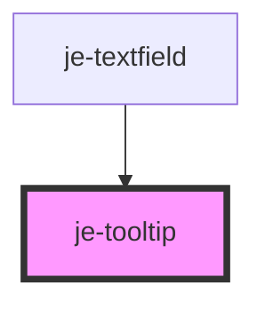

<!-- Auto Generated Below -->

## Properties

| Property  | Attribute  | Description                                                      | Type     | Default     |
| --------- | ---------- | ---------------------------------------------------------------- | -------- | ----------- |
| `content` | `content`  | The content of the tooltip                                       | `string` | `undefined` |
| `offsetX` | `offset-x` | Horizontal offset used when auto positioning the popover content | `number` | `0`         |
| `offsetY` | `offset-y` | Vertical offset used when auto positioning the popover content   | `number` | `10`        |

## Dependencies

### Used by

 - [je-textfield](../je-textfield)

### Graph

----------------------------------------------

*Built with [StencilJS](https://stenciljs.com/)*
