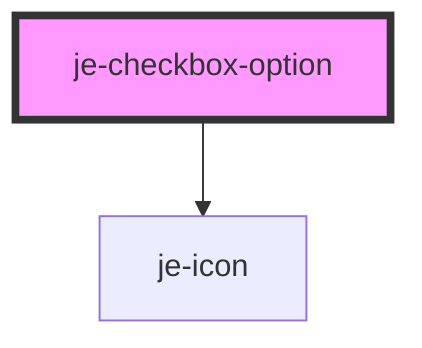

<!-- Auto Generated Below -->

## Properties

| Property   | Attribute  | Description                                                       | Type      | Default     |
| ---------- | ---------- | ----------------------------------------------------------------- | --------- | ----------- |
| `checked`  | `checked`  | Whether or not this option is currently checked                   | `boolean` | `false`     |
| `disabled` | `disabled` | Shows disabled state and prevents changes to this option          | `boolean` | `false`     |
| `readonly` | `readonly` | Shows readonly state and prevents changes to this option          | `boolean` | `false`     |
| `value`    | `value`    | Value of this option that the checkbox group will compare against | `any`     | `undefined` |

## Events

| Event     | Description                              | Type               |
| --------- | ---------------------------------------- | ------------------ |
| `check`   | Emits the value whenever it is checked   | `CustomEvent<any>` |
| `uncheck` | Emits the value whenever it is unchecked | `CustomEvent<any>` |

## Dependencies

### Depends on

- [je-icon](../../je-icon)

### Graph

----------------------------------------------

*Built with [StencilJS](https://stenciljs.com/)*
