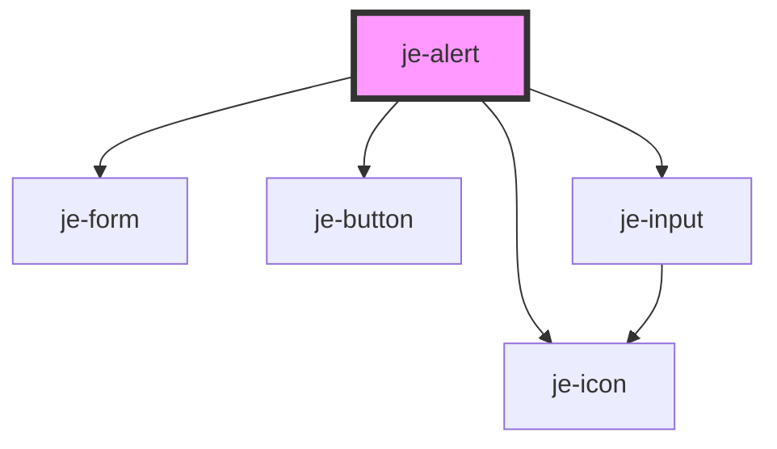

<!-- Auto Generated Below -->

## Properties

| Property        | Attribute        | Description                                                           | Type              | Default     |
| --------------- | ---------------- | --------------------------------------------------------------------- | ----------------- | ----------- |
| `backdropClose` | `backdrop-close` | Whether or not the user can close the dialog by clicking the backdrop | `boolean`         | `true`      |
| `buttons`       | --               | Buttons for user interaction                                          | `DialogButton[]`  | `undefined` |
| `controls`      | --               | Controls that are wrapped in a form                                   | `DialogControl[]` | `undefined` |
| `header`        | `header`         | Title of the dialog                                                   | `string`          | `undefined` |
| `icon`          | `icon`           | Icon that goes to the left of the header                              | `string`          | `undefined` |
| `message`       | `message`        | Message text below the title                                          | `string`          | `undefined` |
| `showBackdrop`  | `show-backdrop`  | Whether or not to render the backdrop                                 | `boolean`         | `true`      |
| `trigger`       | `trigger`        | Trigger element id                                                    | `string`          | `undefined` |

## Events

| Event        | Description                                         | Type                                        |
| ------------ | --------------------------------------------------- | ------------------------------------------- |
| `didDismiss` | Emitted when the dialog is dismissed                | `CustomEvent<{ role: string; data: any; }>` |
| `didPresent` | Emitted when the dialog is presented                | `CustomEvent<any>`                          |
| `didSubmit`  | Emitted when the inner form submission is triggered | `CustomEvent<SubmitEvent>`                  |

## Methods

### `dismiss(role?: string, data?: any) => Promise<void>`

#### Parameters

| Name   | Type     | Description |
| ------ | -------- | ----------- |
| `role` | `string` |             |
| `data` | `any`    |             |

#### Returns

Type: `Promise<void>`

### `present() => Promise<void>`

#### Returns

Type: `Promise<void>`

## Dependencies

### Depends on

- [je-form](../je-form)
- [je-icon](../je-icon)
- [je-button](../je-button)
- [je-input](../je-input)

### Graph

----------------------------------------------

*Built with [StencilJS](https://stenciljs.com/)*
