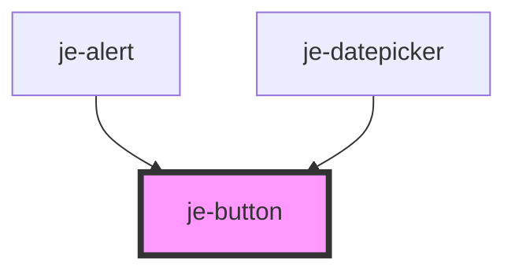

<!-- Auto Generated Below -->

## Properties

| Property         | Attribute          | Description                                                                                      | Type                                                                                                                     | Default     |
| ---------------- | ------------------ | ------------------------------------------------------------------------------------------------ | ------------------------------------------------------------------------------------------------------------------------ | ----------- |
| `color`          | `color`            | Predefined colors. Auto will switch between light and dark based on the closest je-page's theme. | `"auto" \| "dark" \| "error" \| "light" \| "medium" \| "primary" \| "secondary" \| "success" \| "tertiary" \| "warning"` | `'primary'` |
| `darkModeColor`  | `dark-mode-color`  | Overrides what the dark mode color will be when color is "auto".                                 | `"dark" \| "error" \| "light" \| "medium" \| "primary" \| "secondary" \| "success" \| "tertiary" \| "warning"`           | `'light'`   |
| `disabled`       | `disabled`         | Disables button                                                                                  | `boolean`                                                                                                                | `false`     |
| `expand`         | `expand`           | Expands the button to the full width of it's container                                           | `boolean`                                                                                                                | `false`     |
| `fill`           | `fill`             | Button fill                                                                                      | `"clear" \| "outline" \| "solid"`                                                                                        | `'solid'`   |
| `iconOnly`       | `icon-only`        | Removes the padding, ideal for turning an icon or image into a button                            | `boolean`                                                                                                                | `false`     |
| `lightModeColor` | `light-mode-color` | Overrides what the light mode color will be when color is "auto".                                | `"dark" \| "error" \| "light" \| "medium" \| "primary" \| "secondary" \| "success" \| "tertiary" \| "warning"`           | `'dark'`    |
| `size`           | `size`             | Button size                                                                                      | `"lg" \| "md" \| "sm"`                                                                                                   | `'md'`      |
| `type`           | `type`             | Can set to submit or reset to participate in forms                                               | `string`                                                                                                                 | `'button'`  |

## Shadow Parts

| Part             | Description |
| ---------------- | ----------- |
| `"inner-button"` |             |

## CSS Custom Properties

| Name                            | Description              |
| ------------------------------- | ------------------------ |
| `--je-button-active-background` | Pressed background color |
| `--je-button-background`        | Default background color |
| `--je-button-color`             | Text color               |
| `--je-button-font-size`         | Font size                |
| `--je-button-height`            | Fixed height             |
| `--je-button-hover-background`  | Hovered background color |
| `--je-button-inline-padding`    | Inner inline padding     |
| `--je-button-min-width`         | Minimum width            |
| `--je-button-width`             | Optional fixed width     |

## Dependencies

### Used by

 - [je-alert](../je-alert)
 - [je-datepicker](../je-datepicker)

### Graph

----------------------------------------------

*Built with [StencilJS](https://stenciljs.com/)*
