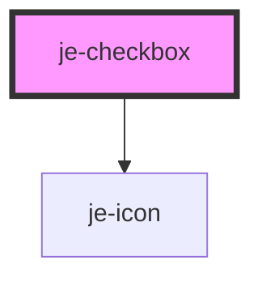

<!-- Auto Generated Below -->

## Properties

| Property         | Attribute         | Description                                                     | Type               | Default     |
| ---------------- | ----------------- | --------------------------------------------------------------- | ------------------ | ----------- |
| `disabled`       | `disabled`        | Shows the disabled state and prevents changes                   | `boolean`          | `false`     |
| `indeterminate`  | `indeterminate`   | If the checkbox should contain a 3rd indeterminate state        | `boolean`          | `false`     |
| `labelOnly`      | `label-only`      | Will hide the checkbox and just display the label               | `boolean`          | `false`     |
| `labelPlacement` | `label-placement` | Whether or not the label should go before or after the checkbox | `"end" \| "start"` | `'end'`     |
| `readonly`       | `readonly`        | Shows the readonly state and prevents changes                   | `boolean`          | `false`     |
| `value`          | `value`           | Whether or not the checkbox is active                           | `boolean`          | `undefined` |

## Events

| Event         | Description                                         | Type                   |
| ------------- | --------------------------------------------------- | ---------------------- |
| `valueChange` | Emits the current value whenever it's state changes | `CustomEvent<boolean>` |

## Dependencies

### Depends on

- [je-icon](../je-icon)

### Graph

----------------------------------------------

*Built with [StencilJS](https://stenciljs.com/)*
