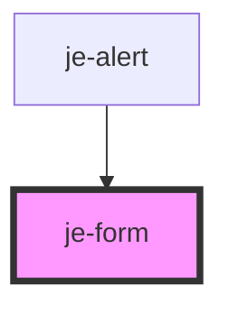

<!-- Auto Generated Below -->

## Properties

| Property | Attribute | Description                                        | Type                  | Default     |
| -------- | --------- | -------------------------------------------------- | --------------------- | ----------- |
| `gap`    | `gap`     | Removes the default gap between elements passed in | `"default" \| "none"` | `'default'` |

## Events

| Event      | Description | Type                    |
| ---------- | ----------- | ----------------------- |
| `formData` |             | `CustomEvent<FormData>` |

## Dependencies

### Used by

 - [je-alert](../je-alert)

### Graph

----------------------------------------------

*Built with [StencilJS](https://stenciljs.com/)*
