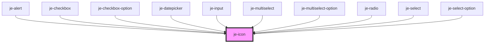

<!-- Auto Generated Below -->

## Properties

| Property | Attribute | Description                              | Type                           | Default     |
| -------- | --------- | ---------------------------------------- | ------------------------------ | ----------- |
| `fill`   | `fill`    | Whether or not the icon should be filled | `boolean`                      | `undefined` |
| `grade`  | `grade`   | Icon grade                               | `"high" \| "low"`              | `undefined` |
| `icon`   | `icon`    | Google material icon name                | `string`                       | `undefined` |
| `size`   | `size`    | Size of the icon                         | `"lg" \| "md" \| "sm" \| "xl"` | `'md'`      |
| `weight` | `weight`  | Icon weight                              | `number`                       | `undefined` |

## CSS Custom Properties

| Name           | Description           |
| -------------- | --------------------- |
| `--je-fill`    | 1 or 0, true or false |
| `--je-grade`   | Emphasis?             |
| `--je-optical` | Stroke weight         |
| `--je-weight`  | icon weight           |

## Dependencies

### Used by

 - [je-alert](../je-alert)
 - [je-checkbox](../je-checkbox)
 - [je-checkbox-option](../checkbox-group/je-checkbox-option)
 - [je-datepicker](../je-datepicker)
 - [je-input](../je-input)
 - [je-multiselect](../multiselect/je-multiselect)
 - [je-multiselect-option](../multiselect/je-multiselect-option)
 - [je-radio](../radio/je-radio)
 - [je-select](../select/je-select)
 - [je-select-option](../select/je-select-option)

### Graph

----------------------------------------------

*Built with [StencilJS](https://stenciljs.com/)*
