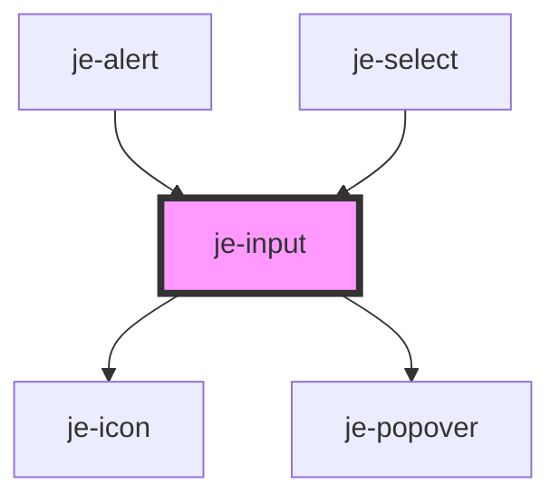

<!-- Auto Generated Below -->

## Properties

| Property         | Attribute          | Description                                                                | Type                                                                                                                                                | Default     |
| ---------------- | ------------------ | -------------------------------------------------------------------------- | --------------------------------------------------------------------------------------------------------------------------------------------------- | ----------- |
| `autoCapitalize` | `auto-capitalize`  | Passed to native input                                                     | `string`                                                                                                                                            | `'off'`     |
| `autoComplete`   | `auto-complete`    | Passed to native input                                                     | `string`                                                                                                                                            | `'off'`     |
| `autoCorrect`    | `auto-correct`     | Passed to native input                                                     | `"off" \| "on"`                                                                                                                                     | `'off'`     |
| `autoFocus`      | `auto-focus`       | Passed to native input                                                     | `boolean`                                                                                                                                           | `undefined` |
| `debounce`       | `debounce`         | Optional debounce of the didInput event                                    | `number`                                                                                                                                            | `0`         |
| `disabled`       | `disabled`         | Renders input as disabled and prevents changes                             | `boolean`                                                                                                                                           | `false`     |
| `dismissOnClick` | `dismiss-on-click` | Whether or not the dropdown should dismiss itself on click                 | `boolean`                                                                                                                                           | `undefined` |
| `dropdown`       | `dropdown`         | Whether or not to render a dropdown when input is focused                  | `boolean`                                                                                                                                           | `false`     |
| `expand`         | `expand`           | Whether or not the input should expand to the full width of it's container | `boolean`                                                                                                                                           | `undefined` |
| `format`         | --                 | Formatter function that gets applied as the user types                     | `((newValue: string, oldValue?: string, ev?: InputEvent) => Promise<string>) \| ((newValue: string, oldValue?: string, ev?: InputEvent) => string)` | `undefined` |
| `helperText`     | `helper-text`      | Helper text directly below the control                                     | `string`                                                                                                                                            | `undefined` |
| `inputMode`      | `input-mode`       | Passed to native input                                                     | `string`                                                                                                                                            | `undefined` |
| `label`          | `label`            | Text above the control                                                     | `string`                                                                                                                                            | `''`        |
| `max`            | `max`              | Passed to native input                                                     | `number \| string`                                                                                                                                  | `undefined` |
| `maxLength`      | `max-length`       | Passed to native input                                                     | `number`                                                                                                                                            | `undefined` |
| `min`            | `min`              | Passed to native input                                                     | `number \| string`                                                                                                                                  | `undefined` |
| `minLength`      | `min-length`       | Passed to native input                                                     | `number`                                                                                                                                            | `undefined` |
| `multiple`       | `multiple`         | Passed to native input                                                     | `boolean`                                                                                                                                           | `false`     |
| `noTyping`       | `no-typing`        | Will prevent changes, does not change the input's state in any way         | `boolean`                                                                                                                                           | `false`     |
| `pattern`        | `pattern`          | Passed to native input                                                     | `string`                                                                                                                                            | `undefined` |
| `placeholder`    | `placeholder`      | Input placeholder text                                                     | `string`                                                                                                                                            | `''`        |
| `readOnly`       | `read-only`        | Renders input as read only and prevents changes                            | `boolean`                                                                                                                                           | `false`     |
| `required`       | `required`         | Marks as required in form and adds asterisk to the end of the label        | `boolean`                                                                                                                                           | `false`     |
| `spellcheck`     | `spellcheck`       | Passed to native input                                                     | `boolean`                                                                                                                                           | `false`     |
| `step`           | `step`             | Passed to native input                                                     | `string`                                                                                                                                            | `undefined` |
| `type`           | `type`             | Passed to native input                                                     | `string`                                                                                                                                            | `'text'`    |
| `validators`     | --                 | Custom validator functions for form participation                          | `(ValidationFn \| AsyncValidationFn)[]`                                                                                                             | `undefined` |
| `value`          | `value`            | Current value of the input                                                 | `string`                                                                                                                                            | `''`        |

## Events

| Event         | Description             | Type                  |
| ------------- | ----------------------- | --------------------- |
| `valueChange` | Emits as the user types | `CustomEvent<string>` |

## Methods

### `dismissDropdown(role?: string) => Promise<void>`

#### Parameters

| Name   | Type     | Description |
| ------ | -------- | ----------- |
| `role` | `string` |             |

#### Returns

Type: `Promise<void>`

### `getInputElement() => Promise<HTMLInputElement>`

#### Returns

Type: `Promise<HTMLInputElement>`

### `hasError() => Promise<boolean>`

#### Returns

Type: `Promise<boolean>`

### `markAsTouched() => Promise<void>`

#### Returns

Type: `Promise<void>`

### `reset() => Promise<void>`

#### Returns

Type: `Promise<void>`

## Shadow Parts

| Part                | Description |
| ------------------- | ----------- |
| `"end-container"`   |             |
| `"label"`           |             |
| `"native-input"`    |             |
| `"outer-container"` |             |
| `"start-container"` |             |

## Dependencies

### Used by

 - [je-alert](../je-alert)
 - [je-select](../select/je-select)

### Depends on

- [je-icon](../je-icon)
- [je-popover](../je-popover)

### Graph

----------------------------------------------

*Built with [StencilJS](https://stenciljs.com/)*
