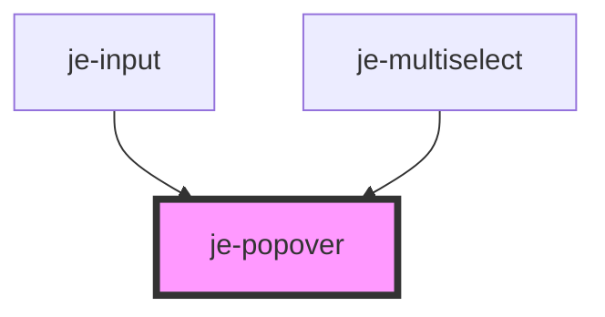

<!-- Auto Generated Below -->

## Properties

| Property          | Attribute          | Description                                                                                                                                | Type                                   | Default     |
| ----------------- | ------------------ | ------------------------------------------------------------------------------------------------------------------------------------------ | -------------------------------------- | ----------- |
| `backdropDismiss` | `backdrop-dismiss` | Backdrop will dismiss the popover on click when enabled                                                                                    | `boolean`                              | `true`      |
| `dismissOnClick`  | `dismiss-on-click` | Popover will automatically dismiss itself when something is clicked in the popover when enabled                                            | `boolean`                              | `false`     |
| `offsetX`         | `offset-x`         | Horizontal offset used when auto positioning the popover content                                                                           | `number`                               | `10`        |
| `offsetY`         | `offset-y`         | Vertical offset used when auto positioning the popover content                                                                             | `number`                               | `10`        |
| `position`        | `position`         | If the popover should auto position itself using the mouse event or the triggerElement.                                                    | `"click" \| "element" \| "none"`       | `'element'` |
| `showBackdrop`    | `show-backdrop`    | Whether or not the backdrop will be visible to the user                                                                                    | `boolean`                              | `false`     |
| `trigger`         | `trigger`          | The id of the element that will present the menu on click. If not provided, you will have to manually present the popover using present(). | `string`                               | `undefined` |
| `triggerAction`   | `trigger-action`   |                                                                                                                                            | `"click" \| "context-menu" \| "hover"` | `'click'`   |

## Events

| Event        | Description                                                                                                                 | Type                                          |
| ------------ | --------------------------------------------------------------------------------------------------------------------------- | --------------------------------------------- |
| `didDismiss` | Emits whenever the popover has finished dismissing. Emits the role and optional data object passed to the dismiss() method. | `CustomEvent<{ role?: string; data?: any; }>` |
| `didPresent` | Emits whenever the popover has presented. Does not emit any data                                                            | `CustomEvent<any>`                            |

## Methods

### `dismiss(role?: string, data?: any) => Promise<void>`

Manually dismisses the popover. Role and data get passed to the didDismiss event.

#### Parameters

| Name   | Type     | Description |
| ------ | -------- | ----------- |
| `role` | `string` |             |
| `data` | `any`    |             |

#### Returns

Type: `Promise<void>`

### `present<T extends PositionStrategy>(positionStrategy: T, target?: Target<T>) => Promise<void>`

Used internally to present the popover. Can also be used to manually
present it if needed. Will auto position itself using the specified
position strategy. If no target is provided, it will use the last mouse
event on the window or the trigger element.

#### Parameters

| Name               | Type                                                                         | Description                                                               |
| ------------------ | ---------------------------------------------------------------------------- | ------------------------------------------------------------------------- |
| `positionStrategy` | `T`                                                                          | The strategy to use when positioning the popover                          |
| `target`           | `T extends "click" ? MouseEvent : T extends "element" ? HTMLElement : never` | Can optionally override the target the popover bases it's position off of |

#### Returns

Type: `Promise<void>`

## Shadow Parts

| Part        | Description |
| ----------- | ----------- |
| `"content"` |             |

## Dependencies

### Used by

 - [je-input](../je-input)
 - [je-multiselect](../multiselect/je-multiselect)

### Graph

----------------------------------------------

*Built with [StencilJS](https://stenciljs.com/)*
