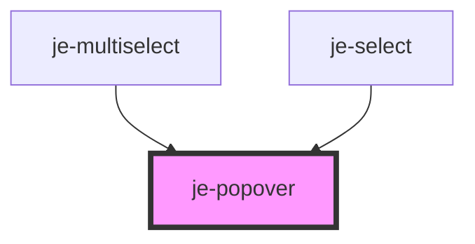

<!-- Auto Generated Below -->

## Properties

| Property           | Attribute           | Description                                                                                     | Type                                                                                                                                                                 | Default     |
| ------------------ | ------------------- | ----------------------------------------------------------------------------------------------- | -------------------------------------------------------------------------------------------------------------------------------------------------------------------- | ----------- |
| `backdropDismiss`  | `backdrop-dismiss`  | Backdrop will dismiss the popover on click when enabled                                         | `boolean`                                                                                                                                                            | `true`      |
| `dismissOnClick`   | `dismiss-on-click`  | Popover will automatically dismiss itself when something is clicked in the popover when enabled | `boolean`                                                                                                                                                            | `false`     |
| `matchWidth`       | `match-width`       | If the popover should match the width of the trigger element                                    | `boolean`                                                                                                                                                            | `false`     |
| `offsetX`          | `offset-x`          | Horizontal offset used when auto positioning the popover content                                | `number`                                                                                                                                                             | `0`         |
| `offsetY`          | `offset-y`          | Vertical offset used when auto positioning the popover content                                  | `number`                                                                                                                                                             | `10`        |
| `open`             | `open`              | Opens/closes the popover                                                                        | `boolean`                                                                                                                                                            | `false`     |
| `placement`        | `placement`         | Where the popover should be placed                                                              | `"bottom" \| "bottom-end" \| "bottom-start" \| "left" \| "left-end" \| "left-start" \| "right" \| "right-end" \| "right-start" \| "top" \| "top-end" \| "top-start"` | `'bottom'`  |
| `positionStrategy` | `position-strategy` | If the popover should position itself using the mouse event or the triggerElement.              | `"click" \| "element"`                                                                                                                                               | `'element'` |
| `showBackdrop`     | `show-backdrop`     | Whether or not the backdrop will be visible to the user                                         | `boolean`                                                                                                                                                            | `false`     |
| `triggerAction`    | `trigger-action`    |                                                                                                 | `"click" \| "context-menu" \| "hover"`                                                                                                                               | `'click'`   |

## Events

| Event            | Description                      | Type               |
| ---------------- | -------------------------------- | ------------------ |
| `popoverDismiss` | Emits when the popover is closed | `CustomEvent<any>` |
| `popoverPresent` | Emits when the popover is opened | `CustomEvent<any>` |

## Shadow Parts

| Part                  | Description |
| --------------------- | ----------- |
| `"backdrop"`          |             |
| `"content"`           |             |
| `"trigger-container"` |             |

## Dependencies

### Used by

 - [je-multiselect](../multiselect/je-multiselect)
 - [je-select](../select/je-select)

### Graph

----------------------------------------------

*Built with [StencilJS](https://stenciljs.com/)*
