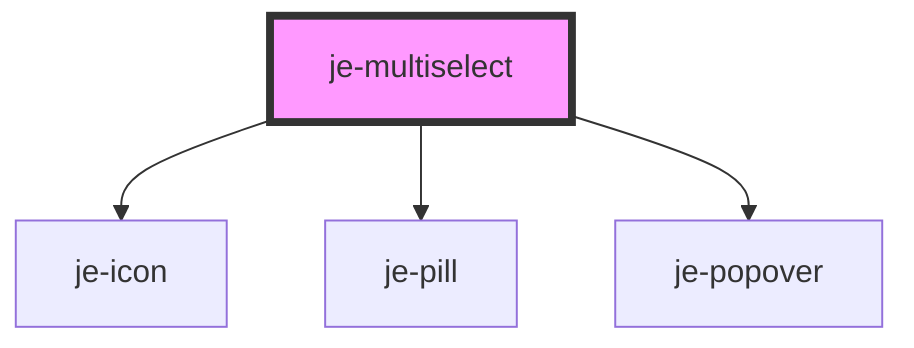

<!-- Auto Generated Below -->

## Properties

| Property      | Attribute     | Description | Type       | Default     |
| ------------- | ------------- | ----------- | ---------- | ----------- |
| `expand`      | `expand`      |             | `boolean`  | `undefined` |
| `label`       | `label`       |             | `string`   | `undefined` |
| `placeholder` | `placeholder` |             | `string`   | `undefined` |
| `required`    | `required`    |             | `boolean`  | `undefined` |
| `value`       | --            |             | `string[]` | `[]`        |

## Shadow Parts

| Part                | Description |
| ------------------- | ----------- |
| `"end-container"`   |             |
| `"label"`           |             |
| `"main-container"`  |             |
| `"outer-container"` |             |
| `"start-container"` |             |

## Dependencies

### Depends on

- [je-icon](../../je-icon)
- [je-pill](../../je-pill)
- [je-popover](../../je-popover)

### Graph

----------------------------------------------

*Built with [StencilJS](https://stenciljs.com/)*
