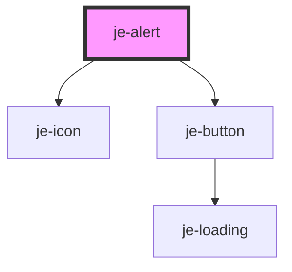

<!-- Auto Generated Below -->


## Usage

### Closable

Adding the `closable` attribute will display a close icon in the top right that hides the alert on click.

::: live-code-demo

```html
<je-alert
  open
  header="hello there"
  message="f u"
  closable
  icon="home"
></je-alert>
```

:::


### Progress

Set the `duration` attribute to have the alert close automatically after the specified amount of milliseconds. The timer will be paused if the user hovers their mouse over the alert, and will resume when the mouse leaves.

::: live-code-demo

```html
<je-alert
  id="progress-alert"
  header="hello there"
  duration="3000"
  class="je-margin-bottom-sm"
></je-alert>
<je-button id="show-progress-alert-button">Open Alert</je-button>
```

```javascript
const button = document.querySelector("#show-progress-alert-button");
const alert = document.querySelector("#progress-alert");
button.addEventListener("click", () => {
  alert.open = true;
});
```

:::


## Properties

| Property   | Attribute  | Description | Type                                              | Default     |
| ---------- | ---------- | ----------- | ------------------------------------------------- | ----------- |
| `closable` | `closable` |             | `boolean`                                         | `false`     |
| `color`    | `color`    |             | `"danger" \| "primary" \| "success" \| "warning"` | `undefined` |
| `duration` | `duration` |             | `number`                                          | `0`         |
| `header`   | `header`   |             | `string`                                          | `undefined` |
| `icon`     | `icon`     |             | `string`                                          | `undefined` |
| `message`  | `message`  |             | `string`                                          | `undefined` |
| `open`     | `open`     |             | `boolean`                                         | `false`     |


## Events

| Event     | Description | Type               |
| --------- | ----------- | ------------------ |
| `dismiss` |             | `CustomEvent<any>` |
| `present` |             | `CustomEvent<any>` |


## Methods

### `didDismiss() => Promise<unknown>`


#### Returns

Type: `Promise<unknown>`


### `hide(role?: string, data?: any) => Promise<void>`


#### Parameters

| Name   | Type     | Description |
| ------ | -------- | ----------- |
| `role` | `string` |             |
| `data` | `any`    |             |

#### Returns

Type: `Promise<void>`


### `show() => Promise<void>`


#### Returns

Type: `Promise<void>`


## Shadow Parts

| Part        | Description |
| ----------- | ----------- |
| `"header"`  |             |
| `"message"` |             |


## Dependencies

### Depends on

- [je-icon](../je-icon)
- [je-button](../je-button)

### Graph


----------------------------------------------


