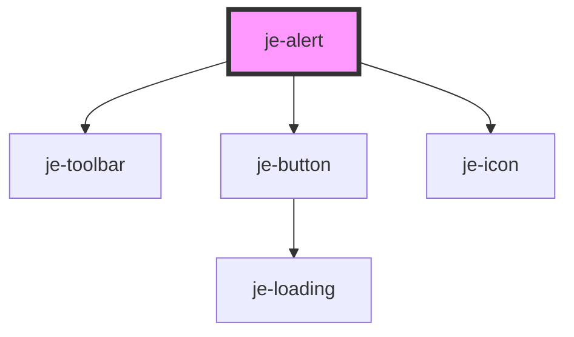

<!-- Auto Generated Below -->


## Usage

### Closable

Adding the `closable` attribute will display a close icon in the top right that hides the alert on click.

::: live-code-demo

```html
<je-alert open closable>
  <je-icon slot="start" fill>home</je-icon>
  <h5>Hello there</h5>
  Where's the chapstick?
</je-alert>
```

:::


### Progress

Set the `duration` attribute to have the alert close automatically after the specified amount of milliseconds. The timer will be paused if the user hovers their mouse over the alert, and will resume when the mouse leaves.

::: live-code-demo

```html
<je-button id="show-progress-alert-button">Open Alert</je-button>
<je-alert id="progress-alert" duration="3000" class="je-margin-top-sm">
  Hello there
</je-alert>
```

```javascript
const button = document.querySelector("#show-progress-alert-button");
const alert = document.querySelector("#progress-alert");
button.addEventListener("click", () => {
  alert.open = true;
});
```

:::


### Slots

The `end` slot can be used for action items like buttons

::: live-code-demo

```html
<je-alert open>
  <je-icon slot="start">settings</je-icon>
  Where's the chapstick?
  <je-button fill="outline" size="sm" slot="end">Undo</je-button>
  <je-button fill="outline" size="sm" slot="end">Dismiss</je-button>
</je-alert>
```

:::


## Properties

| Property   | Attribute  | Description | Type                                              | Default     |
| ---------- | ---------- | ----------- | ------------------------------------------------- | ----------- |
| `closable` | `closable` |             | `boolean`                                         | `false`     |
| `color`    | `color`    |             | `"danger" \| "primary" \| "success" \| "warning"` | `undefined` |
| `duration` | `duration` |             | `number`                                          | `0`         |
| `open`     | `open`     |             | `boolean`                                         | `false`     |


## Events

| Event     | Description | Type               |
| --------- | ----------- | ------------------ |
| `dismiss` |             | `CustomEvent<T>`   |
| `present` |             | `CustomEvent<any>` |


## Methods

### `didDismiss() => Promise<unknown>`


#### Returns

Type: `Promise<unknown>`


### `hide(role?: string, data?: any) => Promise<void>`


#### Parameters

| Name   | Type     | Description |
| ------ | -------- | ----------- |
| `role` | `string` |             |
| `data` | `any`    |             |

#### Returns

Type: `Promise<void>`


### `show() => Promise<void>`


#### Returns

Type: `Promise<void>`


## Dependencies

### Depends on

- [je-toolbar](../je-toolbar)
- [je-button](../je-button)
- [je-icon](../je-icon)

### Graph


----------------------------------------------


