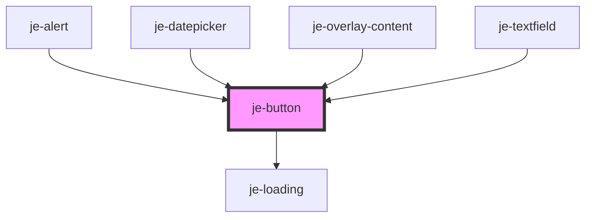

<!-- Auto Generated Below -->

## Properties

| Property   | Attribute  | Description                                                                                                         | Type                                              | Default     |
| ---------- | ---------- | ------------------------------------------------------------------------------------------------------------------- | ------------------------------------------------- | ----------- |
| `color`    | `color`    | Predefined colors                                                                                                   | `"danger" \| "primary" \| "success" \| "warning"` | `undefined` |
| `disabled` | `disabled` | Disables button                                                                                                     | `boolean`                                         | `false`     |
| `expand`   | `expand`   | Expands the button to the full width of it's container                                                              | `boolean`                                         | `false`     |
| `fill`     | `fill`     | Button fill                                                                                                         | `"clear" \| "outline" \| "solid"`                 | `undefined` |
| `form`     | `form`     | Can set form id to participate in forms. Use this if you need to place submit/reset button outside the form element | `string`                                          | `undefined` |
| `pending`  | `pending`  | Shows a loading spinner and disables the button                                                                     | `boolean`                                         | `false`     |
| `size`     | `size`     | Button size                                                                                                         | `"lg" \| "md" \| "sm"`                            | `'md'`      |
| `type`     | `type`     | Can set to submit or reset to participate in forms                                                                  | `"reset" \| "submit"`                             | `undefined` |

## Shadow Parts

| Part             | Description |
| ---------------- | ----------- |
| `"inner-button"` |             |

## CSS Custom Properties

| Name                  | Description              |
| --------------------- | ------------------------ |
| `--active-background` | Pressed background color |
| `--background`        | Default background color |
| `--color`             | Text color               |
| `--font-size`         | Font size                |
| `--height`            | Fixed height             |
| `--hover-background`  | Hovered background color |
| `--padding-inline`    | Inner inline padding     |

## Dependencies

### Used by

 - [je-alert](../je-alert)
 - [je-datepicker](../je-datepicker)
 - [je-overlay-content](../je-overlay-content)
 - [je-textfield](../je-textfield)

### Depends on

- [je-loading](../je-loading)

### Graph

----------------------------------------------

