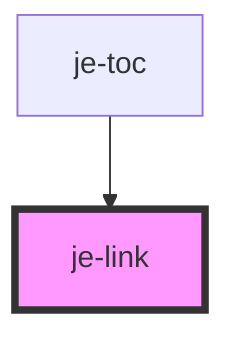

<!-- Auto Generated Below -->

## Properties

| Property    | Attribute   | Description         | Type      | Default     |
| ----------- | ----------- | ------------------- | --------- | ----------- |
| `bold`      | `bold`      | Makes text bold     | `boolean` | `false`     |
| `download`  | `download`  | Passed to anchor    | `string`  | `undefined` |
| `href`      | `href`      | Passed to anchor    | `string`  | `undefined` |
| `rel`       | `rel`       | Passed to anchor    | `string`  | `undefined` |
| `target`    | `target`    | Passed to anchor    | `string`  | `undefined` |
| `underline` | `underline` | Underlines the text | `boolean` | `true`      |

## Shadow Parts

| Part       | Description |
| ---------- | ----------- |
| `"anchor"` |             |

## Dependencies

### Used by

 - [je-toc](../je-toc)

### Graph

----------------------------------------------

