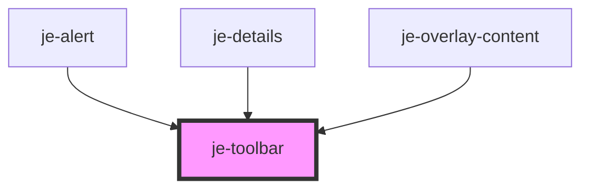

<!-- Auto Generated Below -->

## Properties

| Property | Attribute | Description | Type                                                              | Default |
| -------- | --------- | ----------- | ----------------------------------------------------------------- | ------- |
| `flank`  | `flank`   |             | `"reverse" \| boolean`                                            | `false` |
| `mode`   | `mode`    |             | `"column" \| "row"`                                               | `"row"` |
| `space`  | `space`   |             | `"2xs" \| "3xl" \| "3xs" \| "lg" \| "md" \| "sm" \| "xl" \| "xs"` | `"md"`  |

## Shadow Parts

| Part               | Description |
| ------------------ | ----------- |
| `"end-container"`  |             |
| `"main-container"` |             |

## Dependencies

### Used by

 - [je-alert](../je-alert)
 - [je-details](../je-details)
 - [je-overlay-content](../je-overlay-content)

### Graph

----------------------------------------------

