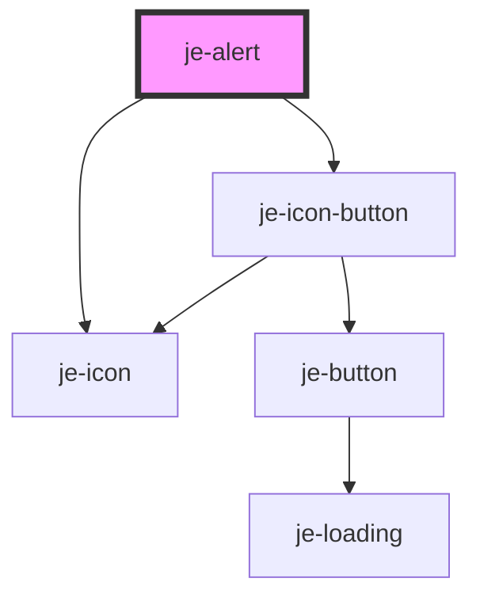

<!-- Auto Generated Below -->

## Properties

| Property   | Attribute  | Description | Type                                                             | Default     |
| ---------- | ---------- | ----------- | ---------------------------------------------------------------- | ----------- |
| `closable` | `closable` |             | `boolean`                                                        | `false`     |
| `color`    | `color`    |             | `"danger" \| "primary" \| "secondary" \| "success" \| "warning"` | `'primary'` |
| `duration` | `duration` |             | `number`                                                         | `0`         |
| `header`   | `header`   |             | `string`                                                         | `undefined` |
| `icon`     | `icon`     |             | `string`                                                         | `undefined` |
| `message`  | `message`  |             | `string`                                                         | `undefined` |
| `open`     | `open`     |             | `boolean`                                                        | `false`     |
| `progress` | `progress` |             | `boolean`                                                        | `false`     |

## Events

| Event     | Description | Type                                          |
| --------- | ----------- | --------------------------------------------- |
| `dismiss` |             | `CustomEvent<{ role?: string; data?: any; }>` |
| `present` |             | `CustomEvent<any>`                            |

## Methods

### `didDismiss() => Promise<OverlayData>`

#### Returns

Type: `Promise<OverlayData>`

### `hide(role?: string, data?: any) => Promise<void>`

#### Parameters

| Name   | Type     | Description |
| ------ | -------- | ----------- |
| `role` | `string` |             |
| `data` | `any`    |             |

#### Returns

Type: `Promise<void>`

### `show() => Promise<void>`

#### Returns

Type: `Promise<void>`

## Shadow Parts

| Part        | Description |
| ----------- | ----------- |
| `"header"`  |             |
| `"message"` |             |

## Dependencies

### Depends on

- [je-icon](../je-icon)
- [je-icon-button](../je-icon-button)

### Graph

----------------------------------------------

*Built with [StencilJS](https://stenciljs.com/)*
