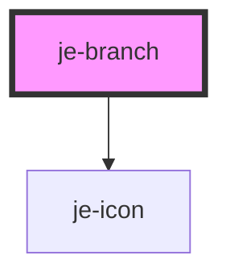

<!-- Auto Generated Below -->

## Properties

| Property   | Attribute  | Description | Type      | Default     |
| ---------- | ---------- | ----------- | --------- | ----------- |
| `label`    | `label`    |             | `string`  | `undefined` |
| `open`     | `open`     |             | `boolean` | `false`     |
| `selected` | `selected` |             | `boolean` | `false`     |
| `value`    | `value`    |             | `string`  | `undefined` |

## Events

| Event          | Description | Type                  |
| -------------- | ----------- | --------------------- |
| `branchSelect` |             | `CustomEvent<string>` |

## Methods

### `getParentBranch() => Promise<HTMLJeBranchElement | null>`

#### Returns

Type: `Promise<HTMLJeBranchElement>`

### `isLeaf() => Promise<boolean>`

#### Returns

Type: `Promise<boolean>`

## Shadow Parts

| Part                       | Description |
| -------------------------- | ----------- |
| `"branch-container"`       |             |
| `"inner-branch-container"` |             |
| `"label"`                  |             |
| `"level"`                  |             |
| `"main-container"`         |             |

## Dependencies

### Depends on

- [je-icon](../je-icon)

### Graph

----------------------------------------------

*Built with [StencilJS](https://stenciljs.com/)*
