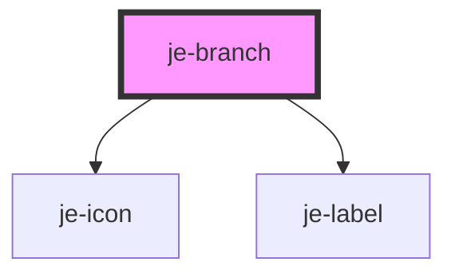

<!-- Auto Generated Below -->

## Properties

| Property      | Attribute     | Description | Type                               | Default     |
| ------------- | ------------- | ----------- | ---------------------------------- | ----------- |
| `indentation` | `indentation` |             | `boolean`                          | `false`     |
| `label`       | `label`       |             | `string`                           | `undefined` |
| `open`        | `open`        |             | `boolean`                          | `false`     |
| `selected`    | `selected`    |             | `boolean`                          | `false`     |
| `selection`   | `selection`   |             | `"leaf" \| "multiple" \| "single"` | `undefined` |
| `value`       | `value`       |             | `string`                           | `undefined` |

## Methods

### `isLeaf() => Promise<boolean>`

#### Returns

Type: `Promise<boolean>`

## Shadow Parts

| Part                       | Description |
| -------------------------- | ----------- |
| `"branch-container"`       |             |
| `"inner-branch-container"` |             |

## Dependencies

### Depends on

- [je-icon](../je-icon)
- [je-label](../je-label)

### Graph

----------------------------------------------

*Built with [StencilJS](https://stenciljs.com/)*
