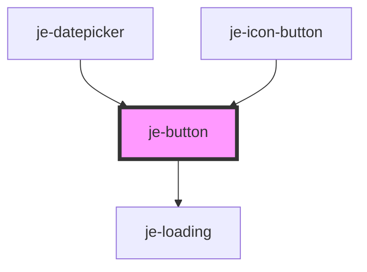

<!-- Auto Generated Below -->

## Properties

| Property   | Attribute  | Description                                            | Type                                                             | Default     |
| ---------- | ---------- | ------------------------------------------------------ | ---------------------------------------------------------------- | ----------- |
| `color`    | `color`    | Predefined colors                                      | `"danger" \| "primary" \| "secondary" \| "success" \| "warning"` | `undefined` |
| `disabled` | `disabled` | Disables button                                        | `boolean`                                                        | `false`     |
| `expand`   | `expand`   | Expands the button to the full width of it's container | `boolean`                                                        | `false`     |
| `fill`     | `fill`     | Button fill                                            | `"clear" \| "outline" \| "solid"`                                | `'solid'`   |
| `pending`  | `pending`  | Shows a loading spinner and disables the button        | `boolean`                                                        | `false`     |
| `size`     | `size`     | Button size                                            | `"lg" \| "md" \| "sm"`                                           | `'md'`      |
| `type`     | `type`     | Can set to submit or reset to participate in forms     | `"reset" \| "submit"`                                            | `undefined` |

## Shadow Parts

| Part             | Description |
| ---------------- | ----------- |
| `"inner-button"` |             |

## Dependencies

### Used by

 - [je-datepicker](../je-datepicker)
 - [je-icon-button](../je-icon-button)

### Depends on

- [je-loading](../je-loading)

### Graph

----------------------------------------------

*Built with [StencilJS](https://stenciljs.com/)*
