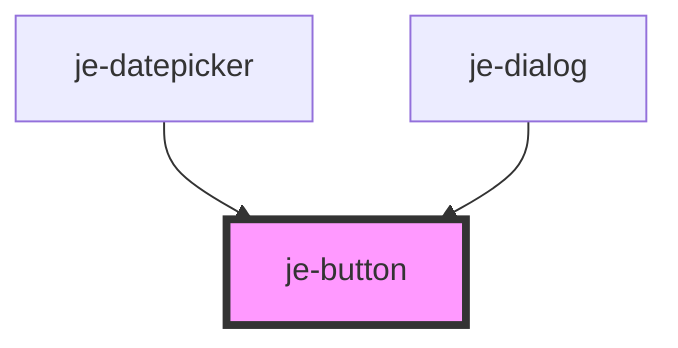

<!-- Auto Generated Below -->

## Properties

| Property   | Attribute  | Description                                                                                  | Type                                                                                            | Default     |
| ---------- | ---------- | -------------------------------------------------------------------------------------------- | ----------------------------------------------------------------------------------------------- | ----------- |
| `color`    | `color`    | Predefined colors. Auto will switch between light and dark based on the current color scheme | `"auto" \| "danger" \| "dark" \| "light" \| "primary" \| "secondary" \| "success" \| "warning"` | `'primary'` |
| `dark`     | `dark`     | Overrides what the dark mode color will be when color is "auto".                             | `"danger" \| "dark" \| "light" \| "primary" \| "secondary" \| "success" \| "warning"`           | `'light'`   |
| `disabled` | `disabled` | Disables button                                                                              | `boolean`                                                                                       | `false`     |
| `expand`   | `expand`   | Expands the button to the full width of it's container                                       | `boolean`                                                                                       | `false`     |
| `fill`     | `fill`     | Button fill                                                                                  | `"clear" \| "outline" \| "solid"`                                                               | `'solid'`   |
| `light`    | `light`    | Overrides what the light mode color will be when color is "auto".                            | `"danger" \| "dark" \| "light" \| "primary" \| "secondary" \| "success" \| "warning"`           | `'dark'`    |
| `size`     | `size`     | Button size                                                                                  | `"lg" \| "md" \| "sm"`                                                                          | `'md'`      |
| `type`     | `type`     | Can set to submit or reset to participate in forms                                           | `"reset" \| "submit"`                                                                           | `undefined` |

## Shadow Parts

| Part             | Description |
| ---------------- | ----------- |
| `"inner-button"` |             |

## CSS Custom Properties

| Name                  | Description              |
| --------------------- | ------------------------ |
| `--active-background` | Pressed background color |
| `--background`        | Default background color |
| `--color`             | Text color               |
| `--font-size`         | Font size                |
| `--height`            | Fixed height             |
| `--hover-background`  | Hovered background color |
| `--inline-padding`    | Inner inline padding     |

## Dependencies

### Used by

 - [je-datepicker](../je-datepicker)
 - [je-dialog](../je-dialog)

### Graph

----------------------------------------------

*Built with [StencilJS](https://stenciljs.com/)*
