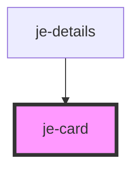

<!-- Auto Generated Below -->

## Properties

| Property | Attribute | Description | Type                                                             | Default     |
| -------- | --------- | ----------- | ---------------------------------------------------------------- | ----------- |
| `button` | `button`  |             | `boolean`                                                        | `undefined` |
| `color`  | `color`   |             | `"danger" \| "primary" \| "secondary" \| "success" \| "warning"` | `undefined` |

## Dependencies

### Used by

 - [je-details](../je-details)

### Graph

----------------------------------------------

*Built with [StencilJS](https://stenciljs.com/)*
