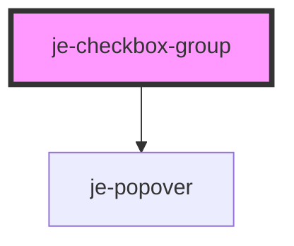

<!-- Auto Generated Below -->

## Properties

| Property       | Attribute     | Description                                                                                                      | Type       | Default     |
| -------------- | ------------- | ---------------------------------------------------------------------------------------------------------------- | ---------- | ----------- |
| `defaultValue` | --            | Default value the control will reset to when used in a form. Will be set automatically when the component loads. | `string[]` | `undefined` |
| `disabled`     | `disabled`    | Shows disabled state and prevents changes                                                                        | `boolean`  | `false`     |
| `helperText`   | `helper-text` | Helper text that shows below the controls                                                                        | `string`   | `undefined` |
| `label`        | `label`       | Label that shows above the controls                                                                              | `string`   | `undefined` |
| `readonly`     | `readonly`    | Shows readonly state and prevents changes                                                                        | `boolean`  | `false`     |
| `required`     | `required`    | Requires at least one option to be selected when used in a form                                                  | `boolean`  | `false`     |
| `value`        | --            | Current selected values                                                                                          | `string[]` | `[]`        |

## Events

| Event         | Description                                            | Type                    |
| ------------- | ------------------------------------------------------ | ----------------------- |
| `valueChange` | Emits the current selected values whenever they change | `CustomEvent<string[]>` |

## Methods

### `checkValidity() => Promise<boolean>`

#### Returns

Type: `Promise<boolean>`

### `reportValidity() => Promise<boolean>`

#### Returns

Type: `Promise<boolean>`

### `reset() => Promise<void>`

#### Returns

Type: `Promise<void>`

### `setCustomValidity(message?: string) => Promise<void>`

#### Parameters

| Name      | Type     | Description |
| --------- | -------- | ----------- |
| `message` | `string` |             |

#### Returns

Type: `Promise<void>`

## Shadow Parts

| Part              | Description |
| ----------------- | ----------- |
| `"error-message"` |             |
| `"helper-text"`   |             |
| `"label"`         |             |

## Dependencies

### Depends on

- [je-popover](../je-popover)

### Graph

----------------------------------------------

*Built with [StencilJS](https://stenciljs.com/)*
