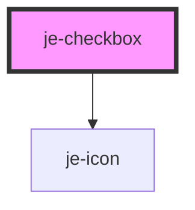

<!-- Auto Generated Below -->

## Properties

| Property         | Attribute         | Description                                                                                                                  | Type               | Default     |
| ---------------- | ----------------- | ---------------------------------------------------------------------------------------------------------------------------- | ------------------ | ----------- |
| `data`           | `data`            | By default, it will submit true or false depending on the checked state. Use this property to submit a custom value instead. | `string`           | `undefined` |
| `indeterminate`  | `indeterminate`   | If the checkbox should contain a 3rd indeterminate state                                                                     | `boolean`          | `false`     |
| `labelPlacement` | `label-placement` | Whether or not the label should go before or after the checkbox                                                              | `"end" \| "start"` | `'end'`     |
| `originalValue`  | `original-value`  | Original value form will reset to                                                                                            | `boolean`          | `undefined` |
| `required`       | `required`        | Marks the control as required in the form. This will only affect indeterminate checkboxes.                                   | `boolean`          | `false`     |
| `value`          | `value`           | Whether or not the checkbox is active                                                                                        | `boolean`          | `undefined` |

## Events

| Event         | Description                                         | Type                   |
| ------------- | --------------------------------------------------- | ---------------------- |
| `valueChange` | Emits the current value whenever it's state changes | `CustomEvent<boolean>` |

## Dependencies

### Depends on

- [je-icon](../je-icon)

### Graph

----------------------------------------------

*Built with [StencilJS](https://stenciljs.com/)*
