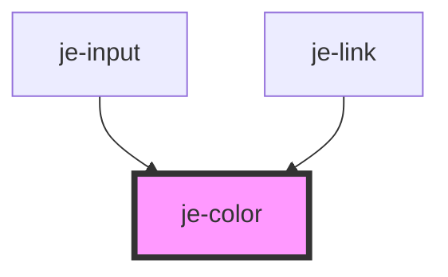

<!-- Auto Generated Below -->

## Properties

| Property         | Attribute          | Description                                                                                      | Type                                                                                                                     | Default     |
| ---------------- | ------------------ | ------------------------------------------------------------------------------------------------ | ------------------------------------------------------------------------------------------------------------------------ | ----------- |
| `color`          | `color`            | Predefined colors. Auto will switch between light and dark based on the closest je-page's theme. | `"auto" \| "dark" \| "error" \| "light" \| "medium" \| "primary" \| "secondary" \| "success" \| "tertiary" \| "warning"` | `'primary'` |
| `darkModeColor`  | `dark-mode-color`  | Overrides what the dark mode color will be when color is "auto".                                 | `"dark" \| "error" \| "light" \| "medium" \| "primary" \| "secondary" \| "success" \| "tertiary" \| "warning"`           | `'light'`   |
| `lightModeColor` | `light-mode-color` | Overrides what the light mode color will be when color is "auto".                                | `"dark" \| "error" \| "light" \| "medium" \| "primary" \| "secondary" \| "success" \| "tertiary" \| "warning"`           | `'dark'`    |

## Dependencies

### Used by

 - [je-input](../je-input)
 - [je-link](../je-link)

### Graph

----------------------------------------------

*Built with [StencilJS](https://stenciljs.com/)*
