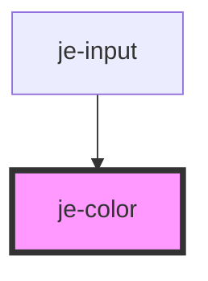

<!-- Auto Generated Below -->

## Properties

| Property | Attribute | Description         | Type                                                                                  | Default     |
| -------- | --------- | ------------------- | ------------------------------------------------------------------------------------- | ----------- |
| `color`  | `color`   | Fixed color         | `"danger" \| "dark" \| "light" \| "primary" \| "secondary" \| "success" \| "warning"` | `undefined` |
| `dark`   | `dark`    | Color in dark mode  | `"danger" \| "dark" \| "light" \| "primary" \| "secondary" \| "success" \| "warning"` | `'light'`   |
| `light`  | `light`   | Color in light mode | `"danger" \| "dark" \| "light" \| "primary" \| "secondary" \| "success" \| "warning"` | `'dark'`    |

## Dependencies

### Used by

 - [je-input](../je-input)

### Graph

----------------------------------------------

*Built with [StencilJS](https://stenciljs.com/)*
