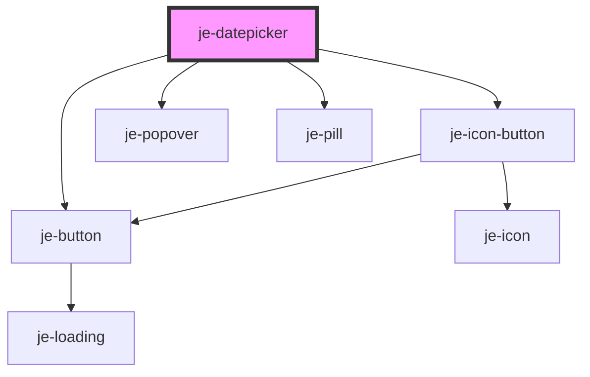

<!-- Auto Generated Below -->

## Properties

| Property         | Attribute         | Description | Type                             | Default      |
| ---------------- | ----------------- | ----------- | -------------------------------- | ------------ |
| `includeSeconds` | `include-seconds` |             | `boolean`                        | `false`      |
| `isDateDisabled` | --                |             | `(date: Date) => boolean`        | `undefined`  |
| `max`            | `max`             |             | `number`                         | `undefined`  |
| `min`            | `min`             |             | `number`                         | `undefined`  |
| `type`           | `type`            |             | `"date" \| "datetime" \| "time"` | `'datetime'` |
| `value`          | `value`           |             | `number`                         | `undefined`  |

## Events

| Event         | Description | Type                  |
| ------------- | ----------- | --------------------- |
| `valueChange` |             | `CustomEvent<number>` |

## Dependencies

### Depends on

- [je-icon-button](../je-icon-button)
- [je-button](../je-button)
- [je-popover](../je-popover)
- [je-pill](../je-pill)

### Graph

----------------------------------------------

*Built with [StencilJS](https://stenciljs.com/)*
