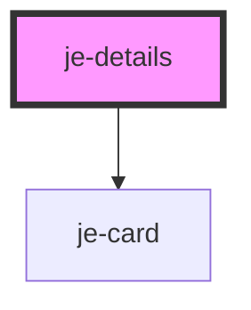

<!-- Auto Generated Below -->

## Properties

| Property  | Attribute | Description | Type                 | Default     |
| --------- | --------- | ----------- | -------------------- | ----------- |
| `state`   | `state`   |             | `"closed" \| "open"` | `'closed'`  |
| `summary` | `summary` |             | `string`             | `undefined` |

## Shadow Parts

| Part                  | Description |
| --------------------- | ----------- |
| `"details-container"` |             |
| `"details-icon"`      |             |
| `"summary-container"` |             |

## Dependencies

### Depends on

- [je-card](../je-card)

### Graph

----------------------------------------------

*Built with [StencilJS](https://stenciljs.com/)*
