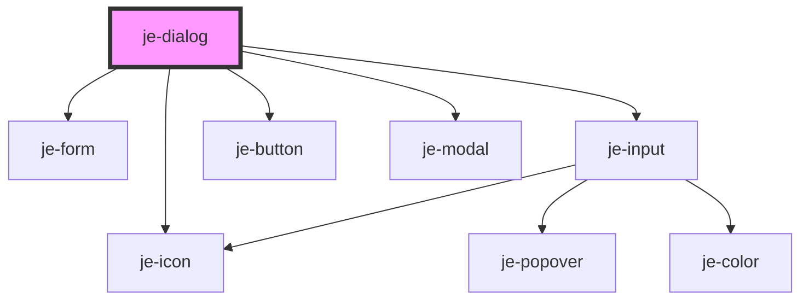

<!-- Auto Generated Below -->

## Properties

| Property          | Attribute          | Description                                                          | Type              | Default     |
| ----------------- | ------------------ | -------------------------------------------------------------------- | ----------------- | ----------- |
| `backdropDismiss` | `backdrop-dismiss` | Whether or not the user can close the alert by clicking the backdrop | `boolean`         | `true`      |
| `buttons`         | --                 | Buttons for user interaction                                         | `DialogButton[]`  | `undefined` |
| `controls`        | --                 | Controls that are wrapped in a form                                  | `DialogControl[]` | `undefined` |
| `header`          | `header`           | Title of the dialog                                                  | `string`          | `undefined` |
| `icon`            | `icon`             | Icon that goes to the left of the header                             | `string`          | `undefined` |
| `message`         | `message`          | Message text below the title                                         | `string`          | `undefined` |
| `showBackdrop`    | `show-backdrop`    | Whether or not to render the backdrop                                | `boolean`         | `true`      |

## Methods

### `dismiss(role?: string, data?: any) => Promise<void>`

#### Parameters

| Name   | Type     | Description |
| ------ | -------- | ----------- |
| `role` | `string` |             |
| `data` | `any`    |             |

#### Returns

Type: `Promise<void>`

### `getModalElement() => Promise<HTMLJeModalElement>`

#### Returns

Type: `Promise<HTMLJeModalElement>`

### `present() => Promise<void>`

#### Returns

Type: `Promise<void>`

## Dependencies

### Depends on

- [je-form](../je-form)
- [je-icon](../je-icon)
- [je-input](../je-input)
- [je-button](../je-button)
- [je-modal](../je-modal)

### Graph

----------------------------------------------

*Built with [StencilJS](https://stenciljs.com/)*
