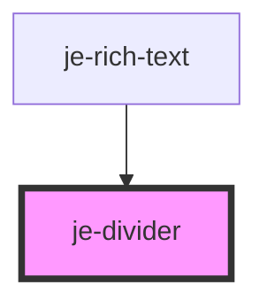

<!-- Auto Generated Below -->

## Properties

| Property  | Attribute | Description | Type                             | Default        |
| --------- | --------- | ----------- | -------------------------------- | -------------- |
| `spacing` | `spacing` |             | `"lg" \| "md" \| "none" \| "sm"` | `'md'`         |
| `type`    | `type`    |             | `"horizontal" \| "vertical"`     | `'horizontal'` |

## Dependencies

### Used by

 - [je-rich-text](../je-rich-text)

### Graph

----------------------------------------------

*Built with [StencilJS](https://stenciljs.com/)*
