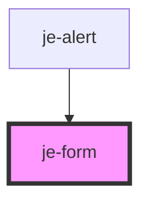

<!-- Auto Generated Below -->

## Events

| Event      | Description | Type                                                |
| ---------- | ----------- | --------------------------------------------------- |
| `formData` |             | `CustomEvent<{ [x: string]: FormDataEntryValue; }>` |

## Dependencies

### Used by

 - [je-alert](../je-alert)

### Graph

----------------------------------------------

*Built with [StencilJS](https://stenciljs.com/)*
