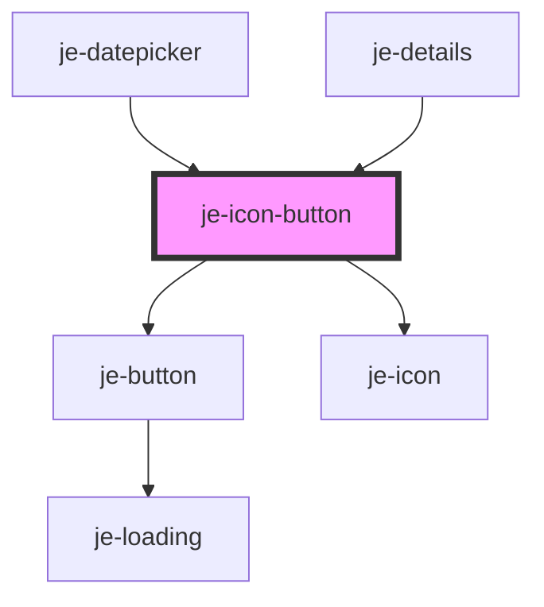

<!-- Auto Generated Below -->

## Properties

| Property   | Attribute  | Description                                        | Type                                                             | Default     |
| ---------- | ---------- | -------------------------------------------------- | ---------------------------------------------------------------- | ----------- |
| `color`    | `color`    | Predefined colors                                  | `"danger" \| "primary" \| "secondary" \| "success" \| "warning"` | `undefined` |
| `disabled` | `disabled` | Disables button                                    | `boolean`                                                        | `false`     |
| `fill`     | `fill`     | Button fill                                        | `"clear" \| "outline" \| "solid"`                                | `'clear'`   |
| `icon`     | `icon`     | Name of icon                                       | `string`                                                         | `undefined` |
| `pending`  | `pending`  | Shows a loading spinner and disables the button    | `boolean`                                                        | `false`     |
| `size`     | `size`     | Button size                                        | `"lg" \| "md" \| "sm"`                                           | `'md'`      |
| `type`     | `type`     | Can set to submit or reset to participate in forms | `"reset" \| "submit"`                                            | `undefined` |

## Shadow Parts

| Part     | Description |
| -------- | ----------- |
| `"icon"` |             |

## Dependencies

### Used by

 - [je-datepicker](../je-datepicker)
 - [je-details](../je-details)

### Depends on

- [je-button](../je-button)
- [je-icon](../je-icon)

### Graph

----------------------------------------------

*Built with [StencilJS](https://stenciljs.com/)*
