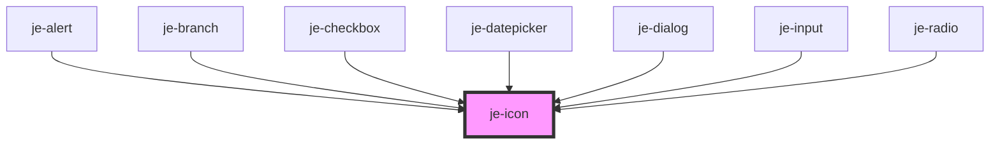

<!-- Auto Generated Below -->

## Properties

| Property   | Attribute  | Description                                         | Type                                   | Default     |
| ---------- | ---------- | --------------------------------------------------- | -------------------------------------- | ----------- |
| `button`   | `button`   | Makes the icon a button                             | `boolean`                              | `false`     |
| `disabled` | `disabled` | Disables button. Does nothing if button is not true | `boolean`                              | `false`     |
| `fill`     | `fill`     | Whether or not the icon should be filled            | `boolean`                              | `false`     |
| `grade`    | `grade`    | Icon grade                                          | `"high" \| "low"`                      | `undefined` |
| `size`     | `size`     | Size of the icon                                    | `"lg" \| "md" \| "sm" \| "xl" \| "xs"` | `'md'`      |
| `weight`   | `weight`   | Icon weight                                         | `number`                               | `400`       |

## Dependencies

### Used by

 - [je-alert](../je-alert)
 - [je-branch](../je-branch)
 - [je-checkbox](../je-checkbox)
 - [je-datepicker](../je-datepicker)
 - [je-dialog](../je-dialog)
 - [je-input](../je-input)
 - [je-radio](../je-radio)

### Graph

----------------------------------------------

*Built with [StencilJS](https://stenciljs.com/)*
