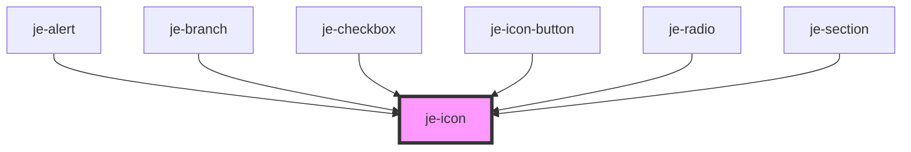

<!-- Auto Generated Below -->

## Properties

| Property | Attribute | Description                              | Type                                   | Default     |
| -------- | --------- | ---------------------------------------- | -------------------------------------- | ----------- |
| `fill`   | `fill`    | Whether or not the icon should be filled | `boolean`                              | `false`     |
| `grade`  | `grade`   | Icon grade                               | `"high" \| "low"`                      | `undefined` |
| `size`   | `size`    | Size of the icon                         | `"lg" \| "md" \| "sm" \| "xl" \| "xs"` | `'md'`      |
| `weight` | `weight`  | Icon weight                              | `number`                               | `400`       |

## Dependencies

### Used by

 - [je-alert](../je-alert)
 - [je-branch](../je-branch)
 - [je-checkbox](../je-checkbox)
 - [je-icon-button](../je-icon-button)
 - [je-radio](../je-radio)
 - [je-section](../je-section)

### Graph

----------------------------------------------

*Built with [StencilJS](https://stenciljs.com/)*
