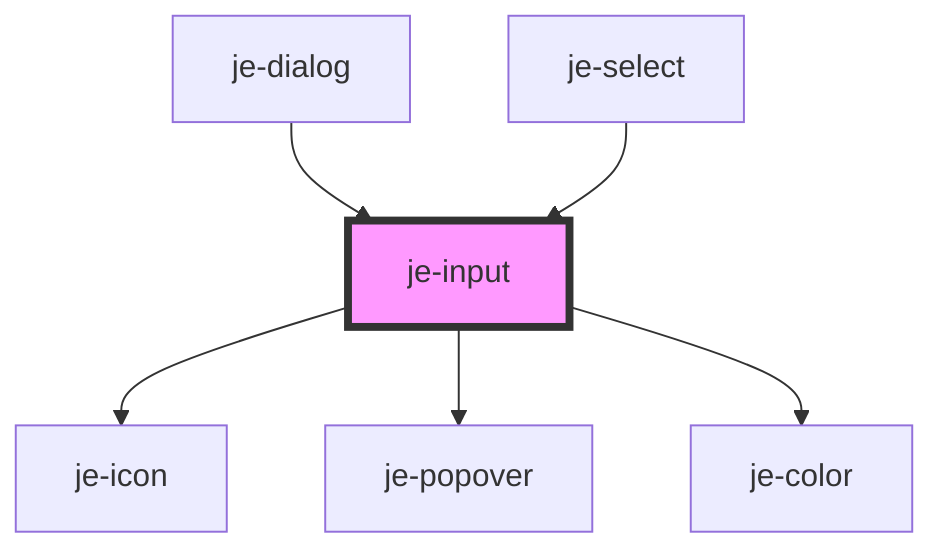

<!-- Auto Generated Below -->

## Properties

| Property         | Attribute        | Description                                                                                                                                                                                                          | Type                                                                                                                                                | Default     |
| ---------------- | ---------------- | -------------------------------------------------------------------------------------------------------------------------------------------------------------------------------------------------------------------- | --------------------------------------------------------------------------------------------------------------------------------------------------- | ----------- |
| `autocapitalize` | `autocapitalize` | Passed to native input                                                                                                                                                                                               | `string`                                                                                                                                            | `'off'`     |
| `autocomplete`   | `autocomplete`   | Passed to native input                                                                                                                                                                                               | `string`                                                                                                                                            | `'off'`     |
| `autocorrect`    | `autocorrect`    | Passed to native input                                                                                                                                                                                               | `"off" \| "on"`                                                                                                                                     | `'off'`     |
| `autofocus`      | `autofocus`      | Passed to native input                                                                                                                                                                                               | `boolean`                                                                                                                                           | `undefined` |
| `debounce`       | `debounce`       | Optional debounce of the didInput event                                                                                                                                                                              | `number`                                                                                                                                            | `0`         |
| `disabled`       | `disabled`       | Renders input as disabled and prevents changes                                                                                                                                                                       | `boolean`                                                                                                                                           | `false`     |
| `expand`         | `expand`         | Whether or not the input should expand to the full width of it's container                                                                                                                                           | `boolean`                                                                                                                                           | `undefined` |
| `format`         | --               | Formatter function that gets applied directly to the input as the user types. Good for input masking.  If you are using an input masking library, you can use the getInputElement() method to fetch the inner input. | `((newValue: string, oldValue?: string, ev?: InputEvent) => Promise<string>) \| ((newValue: string, oldValue?: string, ev?: InputEvent) => string)` | `undefined` |
| `helperText`     | `helper-text`    | Helper text directly below the control                                                                                                                                                                               | `string`                                                                                                                                            | `undefined` |
| `inputmode`      | `inputmode`      | Passed to native input                                                                                                                                                                                               | `string`                                                                                                                                            | `undefined` |
| `label`          | `label`          | Text above the control                                                                                                                                                                                               | `string`                                                                                                                                            | `''`        |
| `max`            | `max`            | Passed to native input                                                                                                                                                                                               | `number \| string`                                                                                                                                  | `undefined` |
| `maxlength`      | `maxlength`      | Passed to native input                                                                                                                                                                                               | `number`                                                                                                                                            | `undefined` |
| `min`            | `min`            | Passed to native input                                                                                                                                                                                               | `number \| string`                                                                                                                                  | `undefined` |
| `minlength`      | `minlength`      | Passed to native input                                                                                                                                                                                               | `number`                                                                                                                                            | `undefined` |
| `multiple`       | `multiple`       | Passed to native input                                                                                                                                                                                               | `boolean`                                                                                                                                           | `false`     |
| `pattern`        | `pattern`        | Passed to native input                                                                                                                                                                                               | `string`                                                                                                                                            | `undefined` |
| `placeholder`    | `placeholder`    | Input placeholder text                                                                                                                                                                                               | `string`                                                                                                                                            | `''`        |
| `readonly`       | `readonly`       | Renders input as read only and prevents changes                                                                                                                                                                      | `boolean`                                                                                                                                           | `false`     |
| `required`       | `required`       | Marks as required in form and adds asterisk to the end of the label                                                                                                                                                  | `boolean`                                                                                                                                           | `false`     |
| `spellcheck`     | `spellcheck`     | Passed to native input                                                                                                                                                                                               | `boolean`                                                                                                                                           | `false`     |
| `step`           | `step`           | Passed to native input                                                                                                                                                                                               | `string`                                                                                                                                            | `undefined` |
| `transform`      | `transform`      | Transforms the value before it is passed to the input (from) and after the input emits a new value (to).  There are built-in transformers for 'number', 'date', and 'datetime'.                                      | `"date" \| "datetime" \| "number" \| ({ to?: (value: string) => any; from?: (value: any) => string; })`                                             | `undefined` |
| `type`           | `type`           | Passed to native input                                                                                                                                                                                               | `string`                                                                                                                                            | `'text'`    |
| `validators`     | --               | Custom validator functions for form participation                                                                                                                                                                    | `(ValidationFn \| AsyncValidationFn)[]`                                                                                                             | `undefined` |
| `value`          | `value`          | Current value of the input                                                                                                                                                                                           | `string`                                                                                                                                            | `''`        |

## Events

| Event         | Description             | Type                  |
| ------------- | ----------------------- | --------------------- |
| `valueChange` | Emits as the user types | `CustomEvent<string>` |

## Methods

### `getErrors() => Promise<{ requiredError: boolean; minLengthError: boolean; maxLengthError: boolean; patternError: boolean; customErrors: string[]; hasError: boolean; }>`

#### Returns

Type: `Promise<{ requiredError: boolean; minLengthError: boolean; maxLengthError: boolean; patternError: boolean; customErrors: string[]; hasError: boolean; }>`

### `getInputElement() => Promise<HTMLInputElement>`

#### Returns

Type: `Promise<HTMLInputElement>`

### `markAsTouched() => Promise<void>`

#### Returns

Type: `Promise<void>`

### `reset() => Promise<void>`

#### Returns

Type: `Promise<void>`

## Shadow Parts

| Part              | Description |
| ----------------- | ----------- |
| `"container"`     |             |
| `"error-message"` |             |
| `"helper"`        |             |
| `"label"`         |             |
| `"native-input"`  |             |

## Dependencies

### Used by

 - [je-dialog](../je-dialog)
 - [je-select](../je-select)

### Depends on

- [je-icon](../je-icon)
- [je-popover](../je-popover)
- [je-color](../je-color)

### Graph

----------------------------------------------

*Built with [StencilJS](https://stenciljs.com/)*
