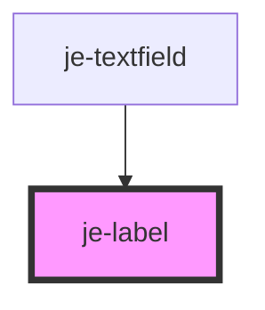

<!-- Auto Generated Below -->

## Properties

| Property   | Attribute  | Description | Type      | Default     |
| ---------- | ---------- | ----------- | --------- | ----------- |
| `for`      | `for`      |             | `string`  | `undefined` |
| `required` | `required` |             | `boolean` | `undefined` |

## Shadow Parts

| Part      | Description |
| --------- | ----------- |
| `"label"` |             |

## Dependencies

### Used by

 - [je-textfield](../je-textfield)

### Graph

----------------------------------------------

*Built with [StencilJS](https://stenciljs.com/)*
