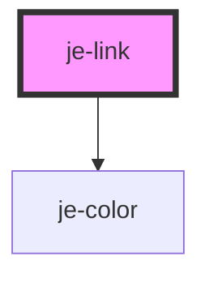

<!-- Auto Generated Below -->

## Properties

| Property         | Attribute          | Description                                                                                      | Type                                                                                                                     | Default     |
| ---------------- | ------------------ | ------------------------------------------------------------------------------------------------ | ------------------------------------------------------------------------------------------------------------------------ | ----------- |
| `bold`           | `bold`             | Makes text bold                                                                                  | `boolean`                                                                                                                | `false`     |
| `color`          | `color`            | Predefined colors. Auto will switch between light and dark based on the closest je-page's theme. | `"auto" \| "dark" \| "error" \| "light" \| "medium" \| "primary" \| "secondary" \| "success" \| "tertiary" \| "warning"` | `undefined` |
| `darkModeColor`  | `dark-mode-color`  | Overrides what the dark mode color will be when color is "auto".                                 | `"dark" \| "error" \| "light" \| "medium" \| "primary" \| "secondary" \| "success" \| "tertiary" \| "warning"`           | `undefined` |
| `download`       | `download`         | Passed to anchor                                                                                 | `string`                                                                                                                 | `undefined` |
| `href`           | `href`             | Passed to anchor                                                                                 | `string`                                                                                                                 | `undefined` |
| `lightModeColor` | `light-mode-color` | Overrides what the light mode color will be when color is "auto".                                | `"dark" \| "error" \| "light" \| "medium" \| "primary" \| "secondary" \| "success" \| "tertiary" \| "warning"`           | `undefined` |
| `rel`            | `rel`              | Passed to anchor                                                                                 | `string`                                                                                                                 | `undefined` |
| `target`         | `target`           | Passed to anchor                                                                                 | `string`                                                                                                                 | `undefined` |
| `underline`      | `underline`        | Underlines the text                                                                              | `boolean`                                                                                                                | `true`      |

## Dependencies

### Depends on

- [je-color](../je-color)

### Graph

----------------------------------------------

*Built with [StencilJS](https://stenciljs.com/)*
