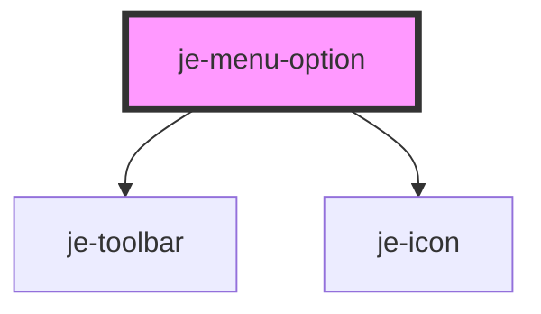

<!-- Auto Generated Below -->

## Properties

| Property   | Attribute  | Description | Type      | Default     |
| ---------- | ---------- | ----------- | --------- | ----------- |
| `checked`  | `checked`  |             | `boolean` | `false`     |
| `disabled` | `disabled` |             | `boolean` | `undefined` |
| `value`    | `value`    |             | `string`  | `undefined` |

## Events

| Event              | Description | Type                  |
| ------------------ | ----------- | --------------------- |
| `menuOptionSelect` |             | `CustomEvent<string>` |

## Dependencies

### Depends on

- [je-toolbar](../je-toolbar)
- [je-icon](../je-icon)

### Graph

----------------------------------------------

*Built with [StencilJS](https://stenciljs.com/)*
