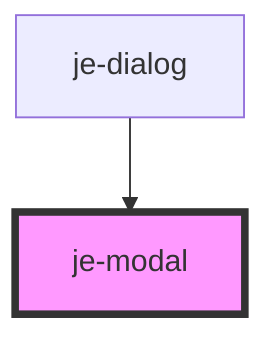

<!-- Auto Generated Below -->

## Properties

| Property          | Attribute          | Description                                             | Type      | Default |
| ----------------- | ------------------ | ------------------------------------------------------- | --------- | ------- |
| `backdropDismiss` | `backdrop-dismiss` | Backdrop will close the modal on click when enabled     | `boolean` | `true`  |
| `open`            | `open`             | Opens and closes modal                                  | `boolean` | `false` |
| `showBackdrop`    | `show-backdrop`    | Whether or not the backdrop will be visible to the user | `boolean` | `true`  |

## Events

| Event          | Description                                                                                                               | Type                                        |
| -------------- | ------------------------------------------------------------------------------------------------------------------------- | ------------------------------------------- |
| `modalDismiss` | Emits whenever the modal has finished closing. Emits the role and optional data object passed to the closeModal() method. | `CustomEvent<{ role: string; data: any; }>` |
| `modalPresent` | Emits whenever the modal has opened. Does not emit any data                                                               | `CustomEvent<any>`                          |

## Methods

### `dismiss(role?: string, data?: any) => Promise<void>`

#### Parameters

| Name   | Type     | Description |
| ------ | -------- | ----------- |
| `role` | `string` |             |
| `data` | `any`    |             |

#### Returns

Type: `Promise<void>`

### `present() => Promise<void>`

#### Returns

Type: `Promise<void>`

## Shadow Parts

| Part                  | Description |
| --------------------- | ----------- |
| `"backdrop"`          |             |
| `"content"`           |             |
| `"trigger-container"` |             |

## Dependencies

### Used by

 - [je-dialog](../je-dialog)

### Graph

----------------------------------------------

*Built with [StencilJS](https://stenciljs.com/)*
