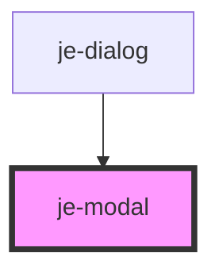

<!-- Auto Generated Below -->

## Properties

| Property          | Attribute          | Description                                             | Type                          | Default     |
| ----------------- | ------------------ | ------------------------------------------------------- | ----------------------------- | ----------- |
| `backdropDismiss` | `backdrop-dismiss` | Backdrop will close the modal on click when enabled     | `boolean`                     | `true`      |
| `destroy`         | --                 | Optionally execute a promise before closing begins      | `() => void \| Promise<void>` | `undefined` |
| `init`            | --                 | Optionally execute a promise before presentation begins | `() => void \| Promise<void>` | `undefined` |
| `open`            | `open`             | Opens and closes modal                                  | `boolean`                     | `false`     |
| `showBackdrop`    | `show-backdrop`    | Whether or not the backdrop will be visible to the user | `boolean`                     | `true`      |

## Events

| Event           | Description                                                                                                         | Type                                          |
| --------------- | ------------------------------------------------------------------------------------------------------------------- | --------------------------------------------- |
| `backdropClick` | Emits whenever the backdrop is clicked. Does not emit any data                                                      | `CustomEvent<any>`                            |
| `dismiss`       | Emits whenever the modal has finished closing. Emits the role and optional data object passed to the hide() method. | `CustomEvent<{ role?: string; data?: any; }>` |
| `present`       | Emits whenever the modal has opened. Does not emit any data                                                         | `CustomEvent<any>`                            |

## Methods

### `didDismiss() => Promise<OverlayData>`

#### Returns

Type: `Promise<OverlayData>`

### `hide(role?: string, data?: any) => Promise<void>`

#### Parameters

| Name   | Type     | Description |
| ------ | -------- | ----------- |
| `role` | `string` |             |
| `data` | `any`    |             |

#### Returns

Type: `Promise<void>`

### `show() => Promise<void>`

#### Returns

Type: `Promise<void>`

## Shadow Parts

| Part                | Description |
| ------------------- | ----------- |
| `"dialog"`          |             |
| `"inner-container"` |             |

## Dependencies

### Used by

 - [je-dialog](../je-dialog)

### Graph

----------------------------------------------

*Built with [StencilJS](https://stenciljs.com/)*
