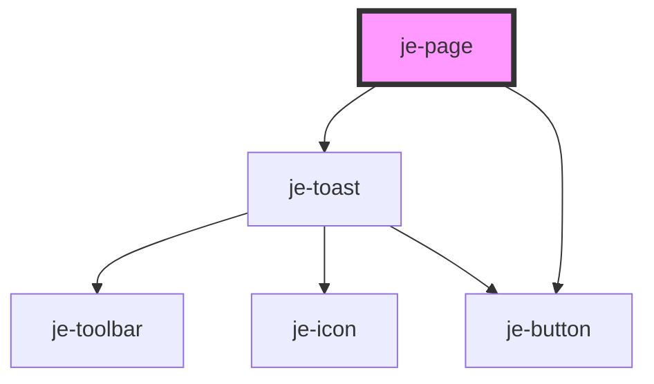

<!-- Auto Generated Below -->

## Properties

| Property     | Attribute     | Description | Type                                | Default    |
| ------------ | ------------- | ----------- | ----------------------------------- | ---------- |
| `footer`     | `footer`      |             | `"fixed" \| "sticky"`               | `'fixed'`  |
| `leftPanel`  | `left-panel`  |             | `"closed" \| "minimized" \| "open"` | `'closed'` |
| `rightPanel` | `right-panel` |             | `"closed" \| "minimized" \| "open"` | `'closed'` |
| `theme`      | `theme`       |             | `"auto" \| "dark" \| "light"`       | `'light'`  |

## Events

| Event         | Description | Type                             |
| ------------- | ----------- | -------------------------------- |
| `themeChange` |             | `CustomEvent<"dark" \| "light">` |

## Methods

### `getCurrentTheme() => Promise<"light" | "dark">`

#### Returns

Type: `Promise<"light" | "dark">`

### `presentToast(options: { header?: string; message?: string; icon?: string; closable?: boolean; duration?: number; progress?: boolean; type?: "card" | "bar"; position?: "top-start" | "top-end" | "bottom-start" | "bottom-end"; buttons?: { text: string; side?: "start" | "end"; fill?: "solid" | "outline" | "clear"; color?: Color | "auto"; size?: "sm" | "md" | "lg"; handler: (toast: HTMLJeToastElement) => void | Promise<void>; }[]; }) => Promise<HTMLJeToastElement>`

#### Parameters

| Name      | Type                                                                                                                                                                                                                                                                                                                                                                                                                                   | Description |
| --------- | -------------------------------------------------------------------------------------------------------------------------------------------------------------------------------------------------------------------------------------------------------------------------------------------------------------------------------------------------------------------------------------------------------------------------------------- | ----------- |
| `options` | `{ header?: string; message?: string; icon?: string; closable?: boolean; duration?: number; progress?: boolean; type?: "card" \| "bar"; position?: "top-start" \| "top-end" \| "bottom-start" \| "bottom-end"; buttons?: { text: string; side?: "start" \| "end"; fill?: "solid" \| "outline" \| "clear"; color?: "auto" \| Color; size?: "sm" \| "md" \| "lg"; handler: (toast: HTMLJeToastElement) => void \| Promise<void>; }[]; }` |             |

#### Returns

Type: `Promise<HTMLJeToastElement>`

## Shadow Parts

| Part                 | Description |
| -------------------- | ----------- |
| `"body-container"`   |             |
| `"sticky-container"` |             |

## Dependencies

### Depends on

- [je-toast](../je-toast)
- [je-button](../je-button)

### Graph

----------------------------------------------

*Built with [StencilJS](https://stenciljs.com/)*
