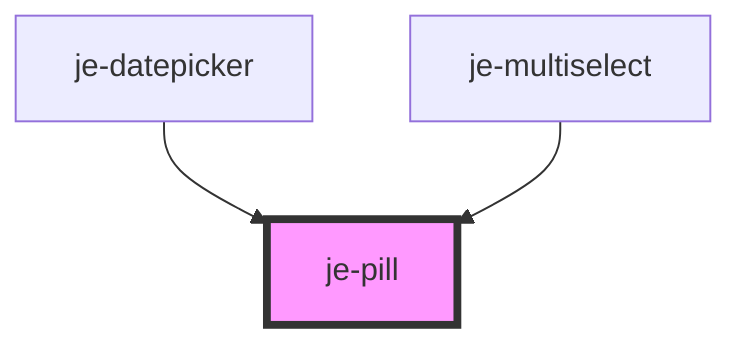

<!-- Auto Generated Below -->

## Properties

| Property   | Attribute  | Description | Type      | Default |
| ---------- | ---------- | ----------- | --------- | ------- |
| `button`   | `button`   |             | `boolean` | `true`  |
| `disabled` | `disabled` |             | `boolean` | `false` |
| `outline`  | `outline`  |             | `boolean` | `false` |

## Dependencies

### Used by

 - [je-datepicker](../je-datepicker)
 - [je-multiselect](../je-multiselect)

### Graph

----------------------------------------------

*Built with [StencilJS](https://stenciljs.com/)*
