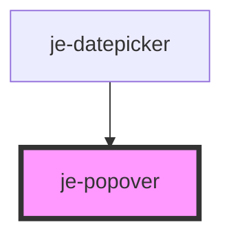

<!-- Auto Generated Below -->

## Properties

| Property           | Attribute           | Description                                                                                                       | Type                                                                                                                                                                 | Default     |
| ------------------ | ------------------- | ----------------------------------------------------------------------------------------------------------------- | -------------------------------------------------------------------------------------------------------------------------------------------------------------------- | ----------- |
| `arrow`            | `arrow`             | Renders an arrow pointing to the trigger                                                                          | `boolean`                                                                                                                                                            | `true`      |
| `arrowPadding`     | `arrow-padding`     | The padding between the arrow and the edges of the popover. Useful if you change the border-radius of the popover | `number`                                                                                                                                                             | `6`         |
| `backdropDismiss`  | `backdrop-dismiss`  | Backdrop will dismiss the popover on click when enabled                                                           | `boolean`                                                                                                                                                            | `true`      |
| `destroy`          | --                  | Execute a callback after the popover has dismissed                                                                | `() => void \| Promise<void>`                                                                                                                                        | `undefined` |
| `dismissOnClick`   | `dismiss-on-click`  | Popover will automatically dismiss itself when something is clicked in the popover when enabled                   | `boolean`                                                                                                                                                            | `false`     |
| `init`             | --                  | Execute a callback before the popover starts presenting                                                           | `() => void \| Promise<void>`                                                                                                                                        | `undefined` |
| `matchWidth`       | `match-width`       | If the popover should match the width of the trigger element                                                      | `boolean`                                                                                                                                                            | `false`     |
| `offsetX`          | `offset-x`          | Horizontal offset used when auto positioning the popover content                                                  | `number`                                                                                                                                                             | `0`         |
| `offsetY`          | `offset-y`          | Vertical offset used when auto positioning the popover content                                                    | `number`                                                                                                                                                             | `10`        |
| `open`             | `open`              | Opens/closes the popover                                                                                          | `boolean`                                                                                                                                                            | `false`     |
| `placement`        | `placement`         | Where the popover should be placed                                                                                | `"bottom" \| "bottom-end" \| "bottom-start" \| "left" \| "left-end" \| "left-start" \| "right" \| "right-end" \| "right-start" \| "top" \| "top-end" \| "top-start"` | `undefined` |
| `positionStrategy` | `position-strategy` | If the popover should position itself using the mouse event or the triggerElement.                                | `"click" \| "element"`                                                                                                                                               | `'element'` |
| `triggerAction`    | `trigger-action`    |                                                                                                                   | `"click" \| "context-menu" \| "hover"`                                                                                                                               | `'click'`   |

## Events

| Event     | Description                                              | Type                                          |
| --------- | -------------------------------------------------------- | --------------------------------------------- |
| `dismiss` | Emits when the popover is closed                         | `CustomEvent<{ role?: string; data?: any; }>` |
| `present` | Emits when the popover is opened                         | `CustomEvent<any>`                            |
| `ready`   | Emits when the popover has completed it's initial render | `CustomEvent<any>`                            |

## Methods

### `hide(role?: string, data?: any) => Promise<void>`

#### Parameters

| Name   | Type     | Description |
| ------ | -------- | ----------- |
| `role` | `string` |             |
| `data` | `any`    |             |

#### Returns

Type: `Promise<void>`

### `show() => Promise<void>`

#### Returns

Type: `Promise<void>`

## Shadow Parts

| Part                  | Description |
| --------------------- | ----------- |
| `"arrow"`             |             |
| `"content"`           |             |
| `"content-container"` |             |

## Dependencies

### Used by

 - [je-datepicker](../je-datepicker)

### Graph

----------------------------------------------

*Built with [StencilJS](https://stenciljs.com/)*
