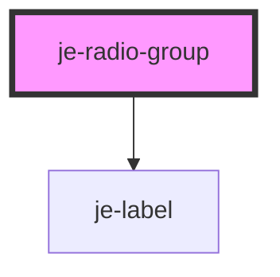

<!-- Auto Generated Below -->

## Properties

| Property        | Attribute        | Description                                                              | Type      | Default     |
| --------------- | ---------------- | ------------------------------------------------------------------------ | --------- | ----------- |
| `label`         | `label`          | Label that shows above the controls                                      | `string`  | `undefined` |
| `originalValue` | `original-value` | Value the form will reset to. Defaults to initial value if not specified | `any`     | `undefined` |
| `required`      | `required`       | Requires a value before the form can be submitted                        | `boolean` | `undefined` |
| `value`         | `value`          | The currently selected value                                             | `any`     | `undefined` |

## Events

| Event         | Description                                  | Type               |
| ------------- | -------------------------------------------- | ------------------ |
| `valueChange` | Emits the selected value whenever it changes | `CustomEvent<any>` |

## Dependencies

### Depends on

- [je-label](../je-label)

### Graph

----------------------------------------------

*Built with [StencilJS](https://stenciljs.com/)*
