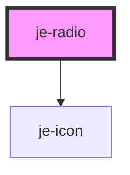

<!-- Auto Generated Below -->

## Properties

| Property         | Attribute         | Description                                                       | Type               | Default     |
| ---------------- | ----------------- | ----------------------------------------------------------------- | ------------------ | ----------- |
| `labelPlacement` | `label-placement` | Whether or not the label will appear before or after the control  | `"end" \| "start"` | `'end'`     |
| `selected`       | `selected`        | If the option is currently selected                               | `boolean`          | `undefined` |
| `value`          | `value`           | The value of this option and the radio group will compare against | `any`              | `undefined` |

## Events

| Event         | Description                             | Type               |
| ------------- | --------------------------------------- | ------------------ |
| `radioSelect` | Emits the value whenever it is selected | `CustomEvent<any>` |

## Dependencies

### Depends on

- [je-icon](../je-icon)

### Graph

----------------------------------------------

*Built with [StencilJS](https://stenciljs.com/)*
