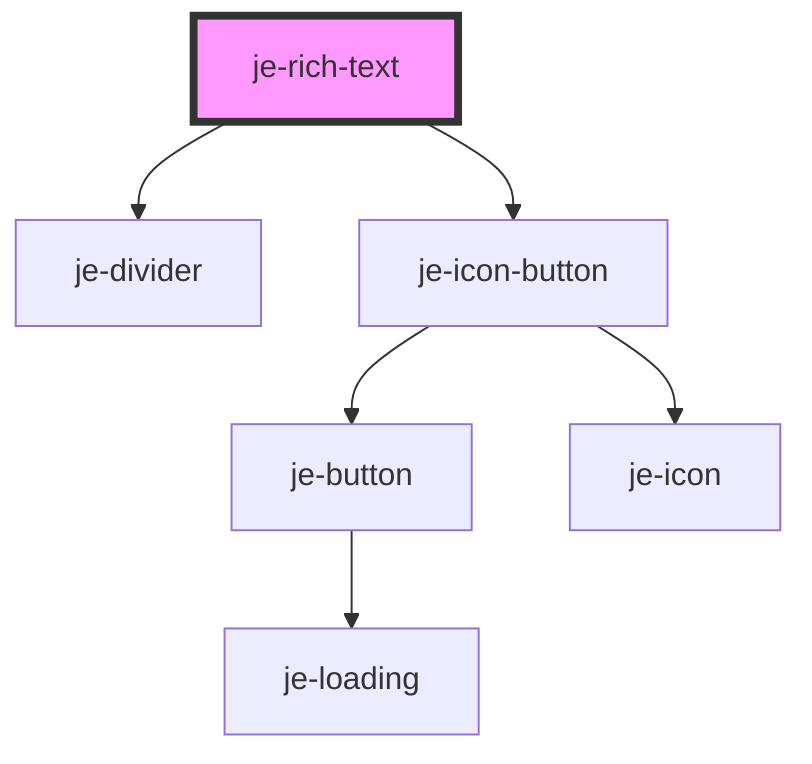

<!-- Auto Generated Below -->

## Properties

| Property | Attribute | Description                         | Type     | Default |
| -------- | --------- | ----------------------------------- | -------- | ------- |
| `value`  | `value`   | The content of the rich text editor | `string` | `''`    |

## Dependencies

### Depends on

- [je-divider](../je-divider)
- [je-icon-button](../je-icon-button)

### Graph

----------------------------------------------

*Built with [StencilJS](https://stenciljs.com/)*
