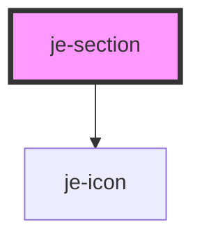

<!-- Auto Generated Below -->

## Properties

| Property      | Attribute     | Description | Type                | Default     |
| ------------- | ------------- | ----------- | ------------------- | ----------- |
| `collapsible` | `collapsible` |             | `boolean`           | `false`     |
| `header`      | `header`      |             | `string`            | `undefined` |
| `iconSide`    | `icon-side`   |             | `"left" \| "right"` | `'right'`   |
| `iconToggle`  | `icon-toggle` |             | `boolean`           | `false`     |
| `open`        | `open`        |             | `boolean`           | `false`     |

## Events

| Event      | Description | Type               |
| ---------- | ----------- | ------------------ |
| `collapse` |             | `CustomEvent<any>` |
| `expand`   |             | `CustomEvent<any>` |

## Shadow Parts

| Part        | Description |
| ----------- | ----------- |
| `"content"` |             |
| `"header"`  |             |
| `"section"` |             |

## Dependencies

### Depends on

- [je-icon](../je-icon)

### Graph

----------------------------------------------

*Built with [StencilJS](https://stenciljs.com/)*
