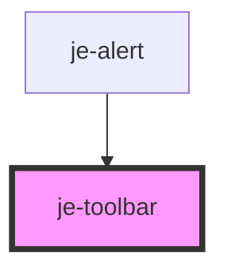

<!-- Auto Generated Below -->

## Shadow Parts

| Part               | Description |
| ------------------ | ----------- |
| `"end-container"`  |             |
| `"main-container"` |             |

## Dependencies

### Used by

 - [je-alert](../je-alert)

### Graph

----------------------------------------------

*Built with [StencilJS](https://stenciljs.com/)*
