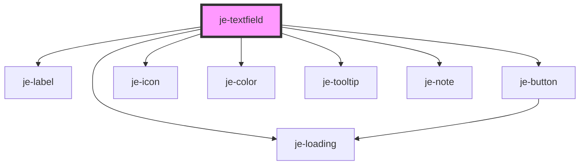

<!-- Auto Generated Below -->

## Properties

| Property                  | Attribute                   | Description                                                                                                                                                                     | Type                                                                                                    | Default     |
| ------------------------- | --------------------------- | ------------------------------------------------------------------------------------------------------------------------------------------------------------------------------- | ------------------------------------------------------------------------------------------------------- | ----------- |
| `autoCapitalize`          | `auto-capitalize`           | Passed to native input                                                                                                                                                          | `string`                                                                                                | `'off'`     |
| `autoComplete`            | `auto-complete`             | Passed to native input                                                                                                                                                          | `string`                                                                                                | `'off'`     |
| `autoCorrect`             | `auto-correct`              | Passed to native input                                                                                                                                                          | `"off" \| "on"`                                                                                         | `'off'`     |
| `autoFocus`               | `auto-focus`                | Passed to native input                                                                                                                                                          | `boolean`                                                                                               | `undefined` |
| `debounce`                | `debounce`                  | Optional debounce of the didInput event                                                                                                                                         | `number`                                                                                                | `0`         |
| `disabled`                | `disabled`                  | Renders input as disabled and prevents changes                                                                                                                                  | `boolean`                                                                                               | `false`     |
| `error`                   | `error`                     | Shows an error icon in the end slot when true. If a string is passed in, it will render the icon as a tooltip. Has no effect on form validation                                 | `any`                                                                                                   | `undefined` |
| `format`                  | `format`                    | Formatters functions that are applied as the user types                                                                                                                         | `(newValue: string, oldValue?: string, ev?: InputEvent) => string \| Promise<string>`                   | `undefined` |
| `inputMode`               | `input-mode`                | Passed to native input                                                                                                                                                          | `string`                                                                                                | `undefined` |
| `label`                   | `label`                     | Text above the control                                                                                                                                                          | `string`                                                                                                | `undefined` |
| `max`                     | `max`                       | Passed to native input                                                                                                                                                          | `any`                                                                                                   | `undefined` |
| `maxlength`               | `maxlength`                 | Passed to native input                                                                                                                                                          | `number`                                                                                                | `undefined` |
| `min`                     | `min`                       | Passed to native input                                                                                                                                                          | `any`                                                                                                   | `undefined` |
| `minlength`               | `minlength`                 | Passed to native input                                                                                                                                                          | `number`                                                                                                | `undefined` |
| `multiline`               | `multiline`                 | Whether the control is a multiline textarea                                                                                                                                     | `boolean`                                                                                               | `false`     |
| `note`                    | `note`                      | Informational message directly below the control                                                                                                                                | `string`                                                                                                | `undefined` |
| `originalValue`           | `original-value`            | The default value the control will reset to in a form. If not set, will default to the inital value of the "value" property.                                                    | `string`                                                                                                | `undefined` |
| `pattern`                 | `pattern`                   | Passed to native input                                                                                                                                                          | `string`                                                                                                | `undefined` |
| `pending`                 | `pending`                   | Shows a loading indicator in the end slot when true                                                                                                                             | `boolean`                                                                                               | `false`     |
| `placeholder`             | `placeholder`               | Input placeholder text                                                                                                                                                          | `string`                                                                                                | `undefined` |
| `readonly`                | `readonly`                  | Renders input as read only and prevents changes                                                                                                                                 | `boolean`                                                                                               | `false`     |
| `required`                | `required`                  | Marks as required in form and adds asterisk to the end of the label                                                                                                             | `boolean`                                                                                               | `false`     |
| `size`                    | `size`                      | Container size                                                                                                                                                                  | `"lg" \| "md" \| "sm"`                                                                                  | `'md'`      |
| `spellcheck`              | `spellcheck`                | Passed to native input                                                                                                                                                          | `boolean`                                                                                               | `false`     |
| `step`                    | `step`                      | Passed to native input                                                                                                                                                          | `string`                                                                                                | `undefined` |
| `success`                 | `success`                   | Shows a success icon in the end slot when true. Has no effect on form validation                                                                                                | `boolean`                                                                                               | `false`     |
| `suppressDefaultBehavior` | `suppress-default-behavior` | Whether to suppress the default behavior of the input event                                                                                                                     | `boolean`                                                                                               | `false`     |
| `transform`               | `transform`                 | Transforms the value before it is passed to the input (from) and after the input emits a new value (to).  There are built-in transformers for 'number', 'date', and 'datetime'. | `"date" \| "datetime" \| "number" \| ({ to?: (value: string) => any; from?: (value: any) => string; })` | `undefined` |
| `type`                    | `type`                      | Passed to native input                                                                                                                                                          | `string`                                                                                                | `'text'`    |
| `validators`              | `validators`                | Validator functions for form participation                                                                                                                                      | `ValidationFn[]`                                                                                        | `undefined` |
| `value`                   | `value`                     | Current value of the input                                                                                                                                                      | `any`                                                                                                   | `undefined` |
| `wrap`                    | `wrap`                      | Passed to native textarea                                                                                                                                                       | `string`                                                                                                | `undefined` |

## Events

| Event         | Description             | Type               |
| ------------- | ----------------------- | ------------------ |
| `valueChange` | Emits as the user types | `CustomEvent<any>` |

## Methods

### `getErrors() => Promise<{ requiredError: boolean; minLengthError: boolean; maxLengthError: boolean; patternError: boolean; customErrors: string[]; hasError: boolean; }>`

#### Returns

Type: `Promise<{ requiredError: boolean; minLengthError: boolean; maxLengthError: boolean; patternError: boolean; customErrors: string[]; hasError: boolean; }>`

### `getInputElement() => Promise<HTMLInputElement | HTMLTextAreaElement>`

#### Returns

Type: `Promise<HTMLInputElement | HTMLTextAreaElement>`

### `isTouched() => Promise<boolean>`

#### Returns

Type: `Promise<boolean>`

### `markAsTouched() => Promise<void>`

#### Returns

Type: `Promise<void>`

## Shadow Parts

| Part          | Description |
| ------------- | ----------- |
| `"container"` |             |
| `"input"`     |             |
| `"label"`     |             |
| `"note"`      |             |
| `"textarea"`  |             |

## Dependencies

### Depends on

- [je-label](../je-label)
- [je-button](../je-button)
- [je-icon](../je-icon)
- [je-loading](../je-loading)
- [je-color](../je-color)
- [je-tooltip](../je-tooltip)
- [je-note](../je-note)

### Graph

----------------------------------------------

*Built with [StencilJS](https://stenciljs.com/)*
