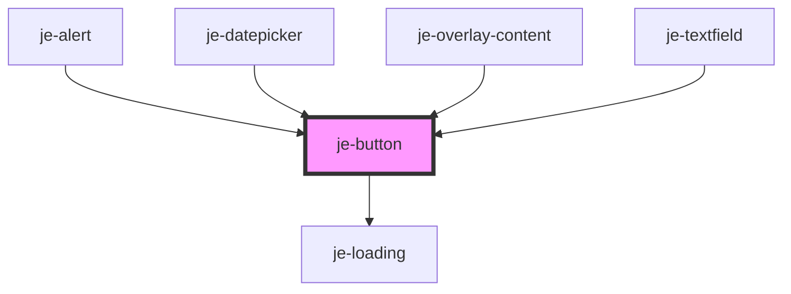

<!-- Auto Generated Below -->


## Usage

### Colors and Types

::: live-code-demo

```html
<strong>Solid</strong><br />
<je-button>Neutral</je-button>
<je-button color="primary">Primary</je-button>
<je-button color="success">Success</je-button>
<je-button color="warning">Warning</je-button>
<je-button color="danger">Danger</je-button>

<je-divider></je-divider>

<strong>Outline</strong><br />
<je-button fill="outline">Neutral</je-button>
<je-button fill="outline" color="primary">Primary</je-button>
<je-button fill="outline" color="success">Success</je-button>
<je-button fill="outline" color="warning">Warning</je-button>
<je-button fill="outline" color="danger">Danger</je-button>

<je-divider></je-divider>

<strong>Clear</strong><br />
<je-button fill="clear">Neutral</je-button>
<je-button fill="clear" color="primary">Primary</je-button>
<je-button fill="clear" color="success">Success</je-button>
<je-button fill="clear" color="warning">Warning</je-button>
<je-button fill="clear" color="danger">Danger</je-button>
```

:::


### Sizes

::: live-code-demo

```html
<je-button size="sm">Small</je-button>
<je-button>Medium</je-button>
<je-button size="lg">Large</je-button>
```

:::


## Properties

| Property   | Attribute  | Description                                                                                                         | Type                                              | Default     |
| ---------- | ---------- | ------------------------------------------------------------------------------------------------------------------- | ------------------------------------------------- | ----------- |
| `color`    | `color`    | Predefined colors                                                                                                   | `"danger" \| "primary" \| "success" \| "warning"` | `undefined` |
| `disabled` | `disabled` | Disables button                                                                                                     | `boolean`                                         | `false`     |
| `expand`   | `expand`   | Expands the button to the full width of it's container                                                              | `boolean`                                         | `false`     |
| `fill`     | `fill`     | Button fill                                                                                                         | `"clear" \| "outline" \| "solid"`                 | `'solid'`   |
| `form`     | `form`     | Can set form id to participate in forms. Use this if you need to place submit/reset button outside the form element | `string`                                          | `undefined` |
| `pending`  | `pending`  | Shows a loading spinner and disables the button                                                                     | `boolean`                                         | `false`     |
| `size`     | `size`     | Button size                                                                                                         | `"lg" \| "md" \| "sm"`                            | `'md'`      |
| `type`     | `type`     | Can set to submit or reset to participate in forms                                                                  | `"reset" \| "submit"`                             | `undefined` |


## CSS Custom Properties

| Name                  | Description              |
| --------------------- | ------------------------ |
| `--active-background` | Pressed background color |
| `--background`        | Default background color |
| `--color`             | Text color               |
| `--font-size`         | Font size                |
| `--height`            | Fixed height             |
| `--hover-background`  | Hovered background color |
| `--padding-inline`    | Inner inline padding     |


## Dependencies

### Used by

 - [je-alert](../je-alert)
 - [je-datepicker](../je-datepicker)
 - [je-overlay-content](../je-overlay-content)
 - [je-textfield](../je-textfield)

### Depends on

- [je-loading](../je-loading)

### Graph


----------------------------------------------


